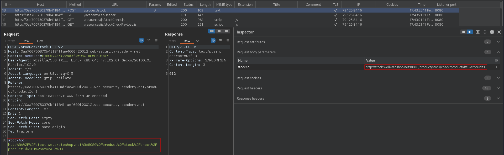
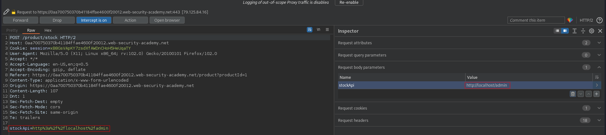
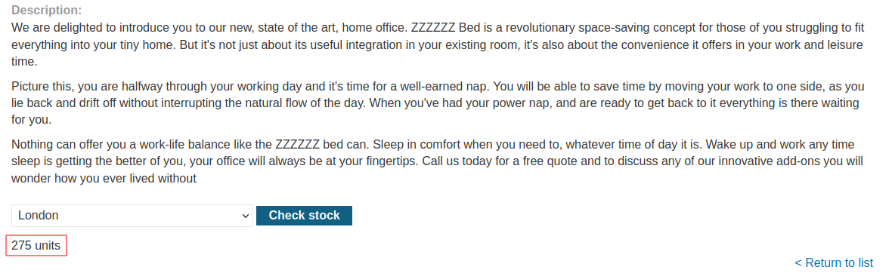
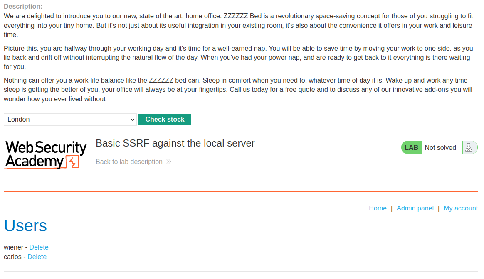
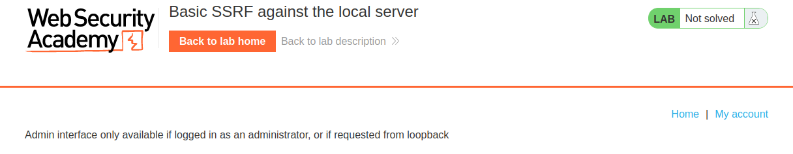
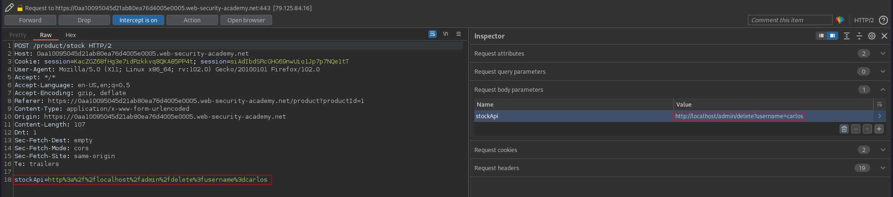

# Basic SSRF against the local server
# Objective
This lab has a stock check feature which fetches data from an internal system.\
\
To solve the lab, change the stock check URL to access the admin interface at `http://localhost/admin` and delete the user carlos.

# Solution
## Analysis
By changing `stockAPI` value it is possible to reach `/admin` page.

||
|:--:| 
| *Original stockAPI URL* |
||
| *Modification of stockAPI value* |

||
|:--:| 
| *Normal behaviour* |
||
| *SSRF* |

## Deletion of user carlos
User carlos must be deleted using the technique above. Admin page cannot be accessed from outside.
||
|:--:| 
| *Error* |
||
| *Deletion of user carlos* |
