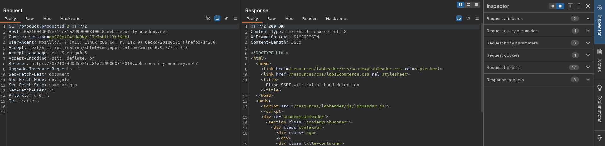
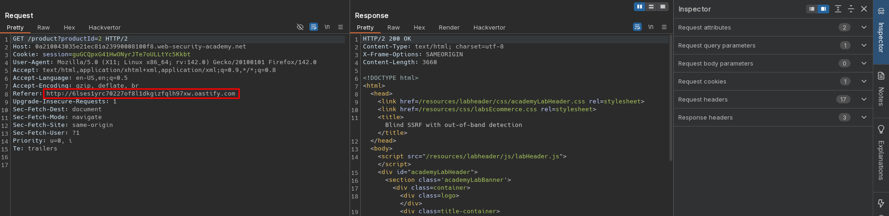
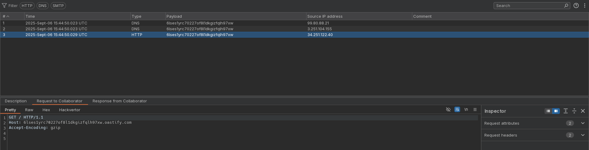

# Blind SSRF with out-of-band detection
# Objective
This site uses analytics software which fetches the URL specified in the Referer header when a product page is loaded.

To solve the lab, use this functionality to cause an HTTP request to the public Burp Collaborator server. 

# Solution
## Analysis

||
|:--:| 
| *Standard request* |

## Exploitation
As this site uses analytics software which fetches the URL specified in the `Referer` header, it is vulnerable to blind, out-of-band SSRF.

||
|:--:| 
| *Modification of Referer header* |
||
| *HTTP request from website* |
