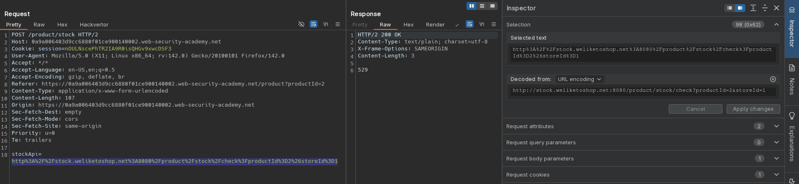
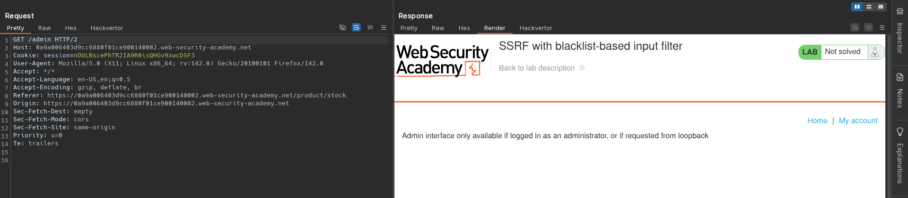
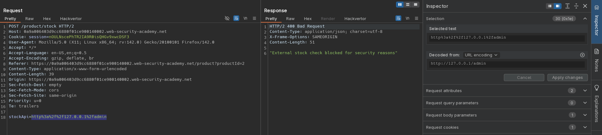
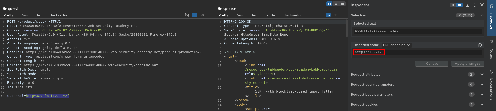
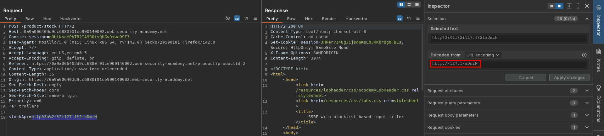
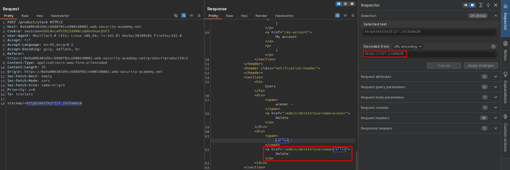
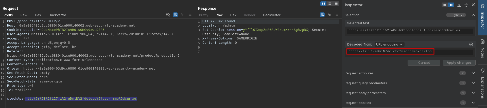

# SSRF with blacklist-based input filter
# Objective
This lab has a stock check feature which fetches data from an internal system.

To solve the lab, change the stock check URL to access the admin interface at `http://localhost/admin` and delete the user carlos.

The developer has deployed two weak anti-SSRF defenses that you will need to bypass. 

# Solution
## Analysis
Website has `Check stock` functionality.

||
|:--:| 
| *Standard request* |
||
| *Request to admin panel* |
||
| *Request blocked - blacklisted destination* |

## Exploitation
Loopback address is blacklisted. Attacker to bypass this restriction can use alternative representations of `127.0.0.1`:
- `127.1` (equivalent to 127.0.0.1)
- `2130706433` (decimal representation)
- `017700000001` (octal representation)
- `0x7f000001` (hexadecimal representation)

In order to access `http://localhhost/admin` attacker have to bypass 2 security filters: loopback filter and string `admin` filter.\
Some of the alternative representations of `127.0.0.1` caused `421 Misdirected Request` or `500 Internal Server Error`.

||
|:--:|
| *Part 1 - Bypass of blacklist-based input filters* |
||
| *Part 2 - Bypass of blacklist-based input filters* |
||
| *Deletion of user carlos* |
||
| *Deletion of user carlos* |

