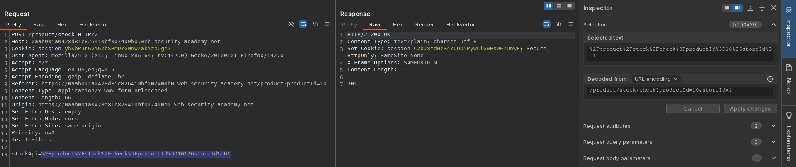
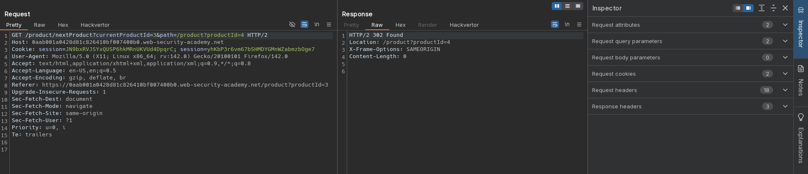
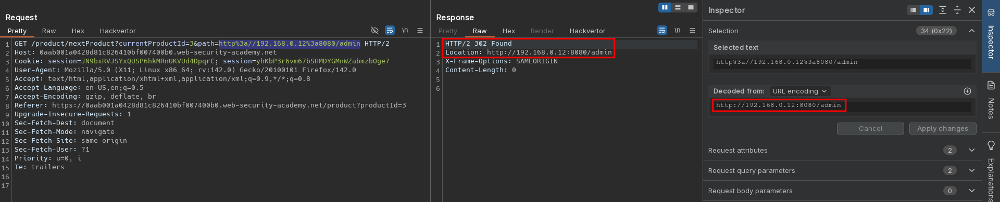
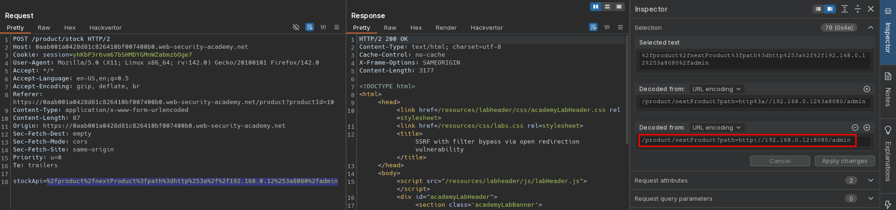
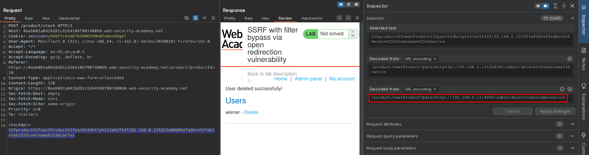

# SSRF with filter bypass via open redirection vulnerability
# Objective
This lab has a stock check feature which fetches data from an internal system.

To solve the lab, change the stock check URL to access the admin interface at `http://192.168.0.12:8080/admin` and delete the user carlos.

The stock checker has been restricted to only access the local application, so you will need to find an open redirect affecting the application first. 

# Solution
## Analysis
Website has `Check stock` and `Next product` functionality.

||
|:--:| 
| *Standard check stock request* |
||
| *Standard next product request* |

## Exploitation
### Open redirect vulenrability
Functionality `Next product` has open redirect vulnerability.

||
|:--:| 
| *Standard check stock request* |

### Server side request forgery
In order to achieve SSRF and access admin panel (`http://192.168.0.12:8080/admin`) attacker can use shown above open redirect vulnerability with `Check stock` functionality.

||
|:--:| 
| *Access to admin's panel* |
||
| *Deletion of user carlos* |
||
| *Deletion of user carlos* |

