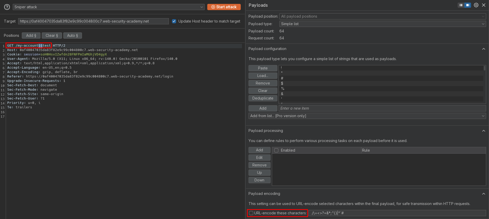
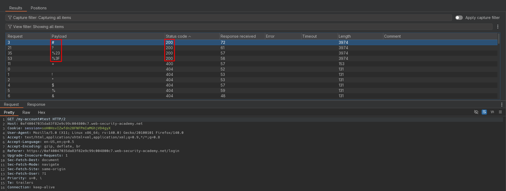

# Exploiting cache server normalization for web cache deception
# Objective
To solve the lab, find the API key for the user carlos. You can log in to your own account using the following credentials: `wiener:peter`.

List of possible delimiter characters: [Web cache deception lab delimiter list](https://portswigger.net/web-security/web-cache-deception/wcd-lab-delimiter-list).

# Solution
## Analysis
Request to `/my-account` returns information about logged user with his API key.

||
|:--:| 
| *User profile page* |

## Exploitation
### Delimeter enumeration - delimiter discrepancies check
Character `?` is generally used to separate the URL path from the query string. However, as the URI RFC is quite permissive, variations still occur between different frameworks or technologies.

Common delimeters to exploit web cache deception are: `.`, `;`, `%00`, `%23` and [more](https://portswigger.net/web-security/web-cache-deception/wcd-lab-delimiter-list). Some delimiter characters may be processed by the victim's browser before it forwards the request to the cache. This means that some delimiters can't be used in an exploit. For example, browsers URL-encode characters like `{`, `}`, `<`, and `>`, and use `#` to truncate the path. 

Additionaly there may be delimiter decoding discrepancies that could lead to web cache deception vulnerabilities.

Enumeration revealed that origin server uses delimiters: `%23` (`#`), `%3F` (`?`).

||
|:--:| 
| *Intruder configuration - deselected URL encoding* |
||
| *Intruder results* |

### Normalization discrepancies - cache server normalization
Cached responses from `/my-account%2f%2e%2e%2fresources/css/labs.css` returns HTTP `200`. If request is not cached it returns HTTP code `404`. This indicates that request `/my-account%2f%2e%2e%2fresources/css/labs.css` is normalized by cache server to `/resources/css/labs.css`. Origin server interprets request as `/my-account%2f%2e%2e%2fresources/css/labs.css`. 

Exploitation scenario for cache server normalization:
```
URL encoded: /<dynamic-path>/..%2f<static-directory-prefix>
URL encoded: /<dynamic-path>%2f%2e%2e%2f<static-directory-prefix>

URL decoded: /<dynamic-path>/../<static-directory-prefix>
```

In order to exploit web cache deception attacker can combine this finding with delimiter discrepancy from previous heading. Request to `/my-account%23%2f%2e%2e%2fresources/css/labs.css` are interpreted by origin server as `/my-account`, ignoring the rest of query. Cache server still normalizes request to `/resources/css/labs.css` enabling its caching rules for static content. Therefore, attacker can force application to cache user secret data from `/my-account` by exploiting normalization discrepancies and delimiter discrepancy.

Exploitation scenario for cache server normalization with delimiter discrepancy:
```
URL encoded: /<dynamic-path><delimiter>%23%2f%2e%2e%2f<static-directory-prefix>
URL encoded: /<dynamic-path><delimiter>%23/..%2f<static-directory-prefix>

URL decoded: /<dynamic-path><delimiter>#/../<static-directory-prefix>
```

||
|:--:| 
| *First request - Cache miss* |
||
| *Second request - Cache hit* |
||
| *Third request without session cookie - Cache hit* |
||
| *Third request without session cookie - Cache hit* |

### Exploitation of normalization discrepancy
Final payload:
```js
<script>document.location="https://0af40047035da83f82e9c99c004800c7.web-security-academy.net/my-account%23%2f%2e%2e%2fresources/css/labs.css"</script>
```

||
|:--:| 
| *Retrieval of Carlos API key from cached response* |


