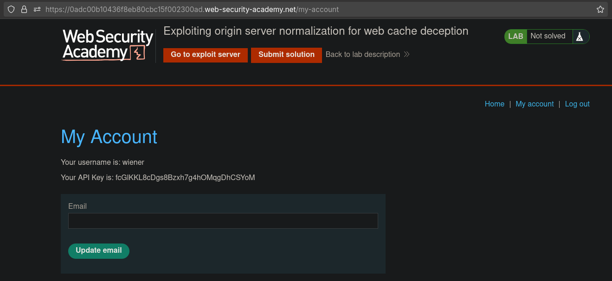
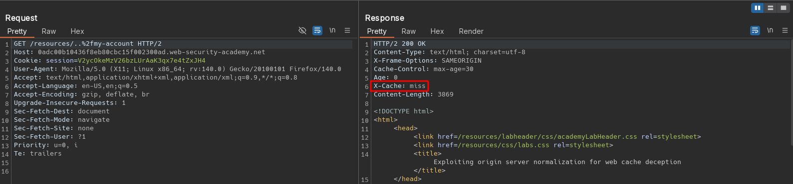
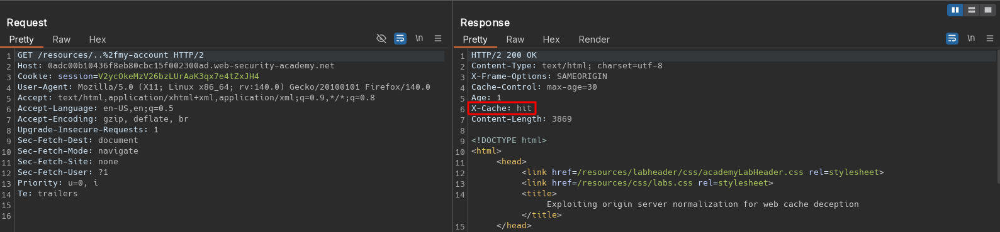
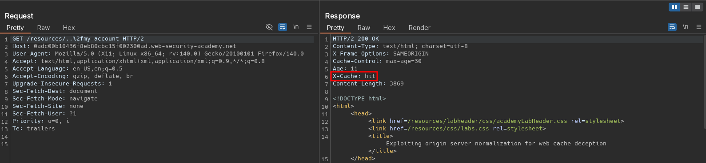
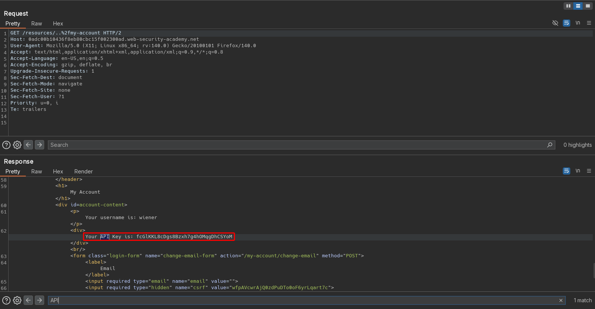
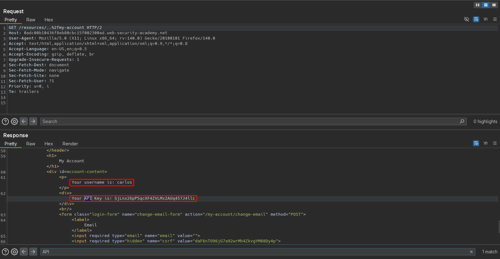

# Exploiting origin server normalization for web cache deception
## Objective
To solve the lab, find the API key for the user carlos. You can log in to your own account using the following credentials: `wiener:peter`.

List of possible delimiter characters: [Web cache deception lab delimiter list](https://portswigger.net/web-security/web-cache-deception/wcd-lab-delimiter-list).

# Solution
## Analysis
Request to `/my-account` returns information about logged user with his API key.

||
|:--:| 
| *User profile page* |

## Exploitation
### Normalization discrepancies - origin server normalization
All responses from `/resources/...` are cached. Request to `/resources/..%2fmy-account` is normalized to `/my-account` by origin server but not by cached server. The origin server decodes slash character (`%2f`) and resolves dot-segments. Cache server interprets request as `/resources/..%2fmy-account` and caches it because it is probably configured to cache every request that starts with `/resources/...`. Therefore, attacker can force application to cache user secret data from `/my-account` by exploiting normalization discrepancies.

To aid indentification of intersting delimiters, they can be brute forced like:
```
/my-account§§test
/my-account§§test.js
```

Exploitation scenario for origin server normalization:
```
/<static-directory-prefix>/..%2f<dynamic-path>
```

||
|:--:| 
| *First request - Cache miss* |
||
| *Second request - Cache hit* |
||
| *Third request without session cookie - Cache hit* |
||
| *Third request without session cookie - Cache hit* |


### Exploitation of normalization discrepancy
Final payload:
```js
<script>document.location="https://0adc00b10436f8eb80cbc15f002300ad.web-security-academy.net/resources/..%2fmy-account"</script>
```

||
|:--:| 
| *Retrieving Carlos API key from cached response* |