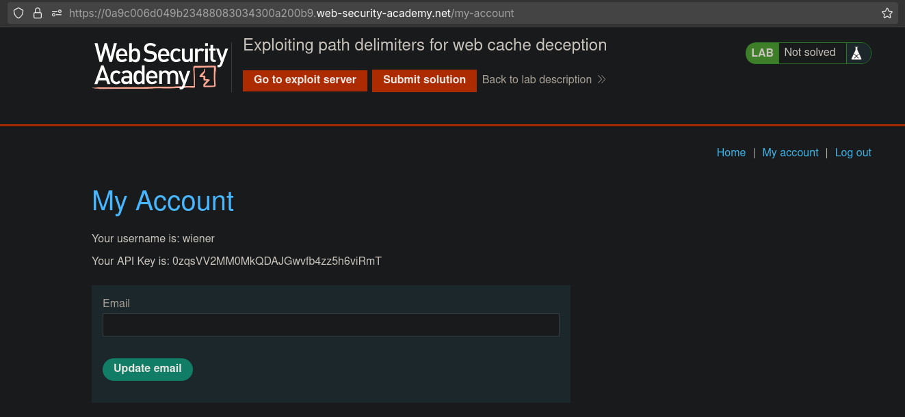
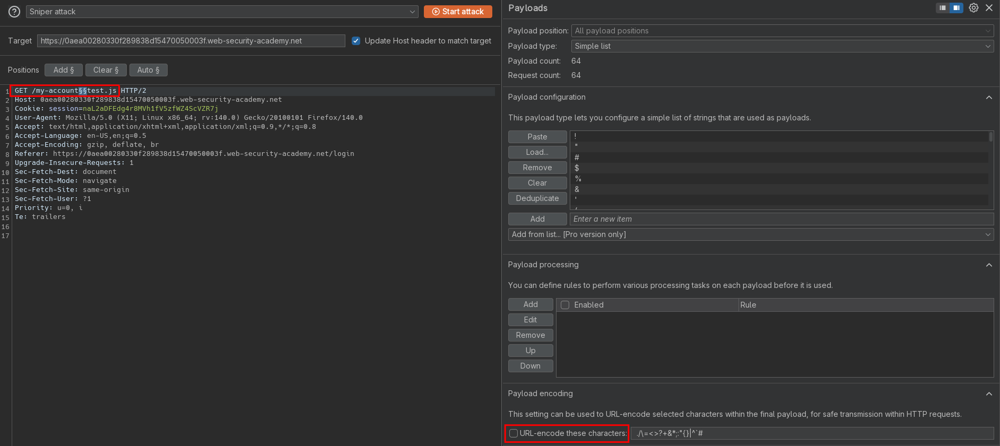
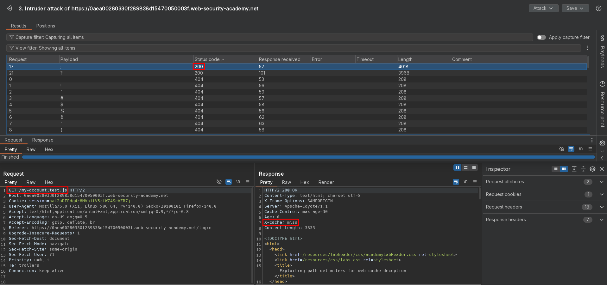
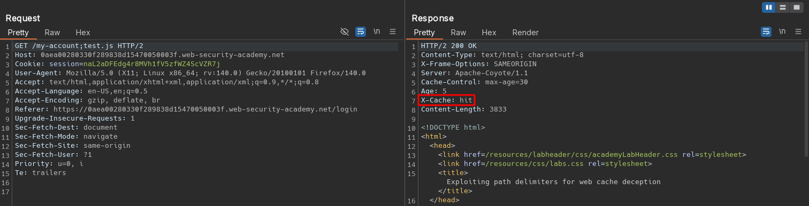
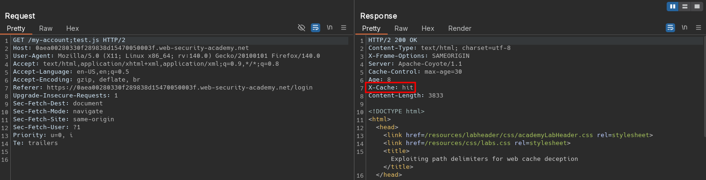
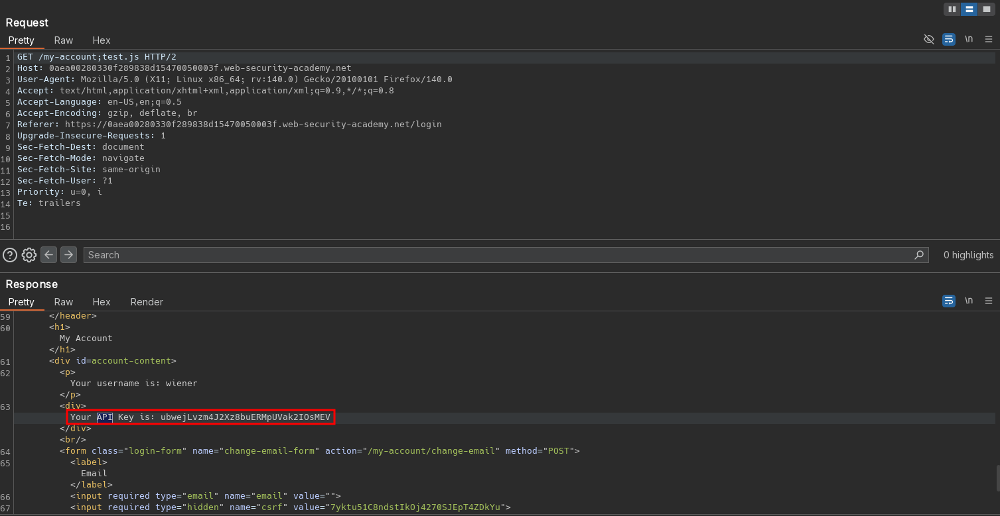
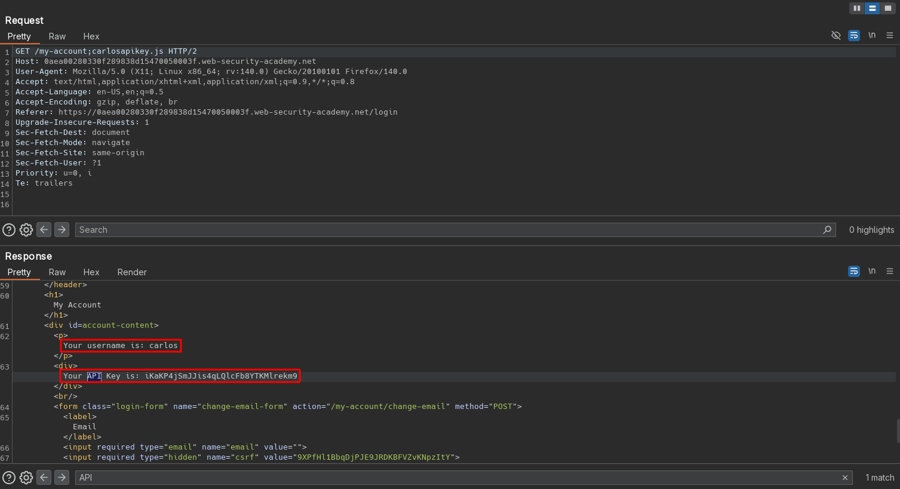

# Exploiting path delimiters for web cache deception
# Objective
To solve the lab, find the API key for the user carlos. You can log in to your own account using the following credentials: `wiener:peter`.

List of possible delimiter characters: [Web cache deception lab delimiter list](https://portswigger.net/web-security/web-cache-deception/wcd-lab-delimiter-list). 

# Solution
## Analysis
Request to `/my-account` returns information about logged user with his API key.

||
|:--:| 
| *User profile page* |

## Exploitation
### Delimeter enumeration - delimiter discrepancies check
Character `?` is generally used to separate the URL path from the query string. However, as the URI RFC is quite permissive, variations still occur between different frameworks or technologies.

Common delimeters to exploit web cache deception are: `.`, `;`, `%00`, `%23` and [more](https://portswigger.net/web-security/web-cache-deception/wcd-lab-delimiter-list). Some delimiter characters may be processed by the victim's browser before it forwards the request to the cache. This means that some delimiters can't be used in an exploit. For example, browsers URL-encode characters like `{`, `}`, `<`, and `>`, and use `#` to truncate the path. 

Additionaly there may be delimiter decoding discrepancies that could lead to web cache deception vulnerabilities.

Enumeration revealed discreapncy while using delimiter: `;`.

||
|:--:| 
| *Intruder configuration - deselected URL encoding* |
||
| *Intruder results* |
| *Adding file after semicolon does not trigger error* |
| *First request - Cache miss* |
||
| *Second request - Cache hit* |
||
| *Third request without session cookie - Cache hit* |
||
| *Third request without session cookie - Cache hit* |

### Exploitation of path delimiter
Reques with extra data after in path after `/my-account` are cached and can be accessed by everyone.

Final payload:
```js
<script>document.location="https://0aac00ef04b1e03d8011589e0032006f.web-security-academy.net/my-account;carlosapikey.js"</script>
```

||
|:--:| 
| *Retrieving Carlos API key from cached response* |