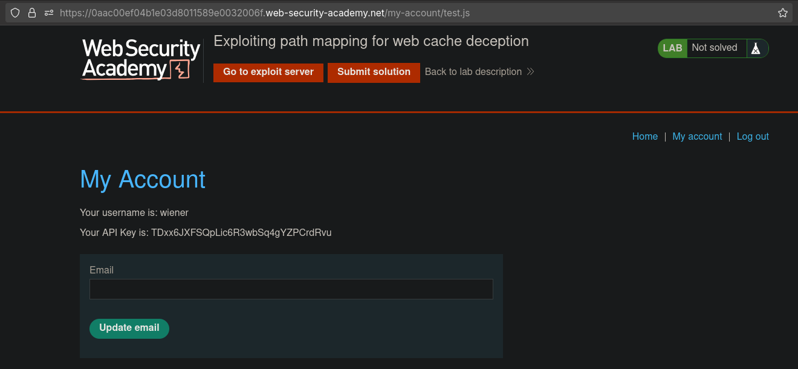

# Exploiting path mapping for web cache deception
# Objective
To solve the lab, find the API key for the user carlos. You can log in to your own account using the following credentials: `wiener:peter`. 


# Solution
## Analysis
Request to `/my-account` returns information about logged user with his API key.

||
|:--:| 
| *User profile page* |
||
| *Adding data to path does not result in error* |
||
| *Adding files (js/css/png/...) to path does not result in error* |
||
| *Responses with extra data in path are cached and can be accessed by everyone* |

## Exploitation
Reques with extra data after in path after `/my-account` are cached and can be accessed by everyone. URL is not mapped to to a resource located on the file system (`Traditional mapping`), instead it is mapped to abstract file paths that are converted into logical parts of the API (`REST-style`).

||
|:--:| 
| *First request - Cache miss* |
||
| *Second request - Cache hit* |
||
| *Third request without session cookie - Cache hit* |
||
| *Third request without session cookie - Cache hit* |


Final payload:
```js
<script>document.location="https://0aac00ef04b1e03d8011589e0032006f.web-security-academy.net/my-account/carlosapikey.js"</script>
```

||
|:--:| 
| *Retrieving Carlos API key from cached response* |
