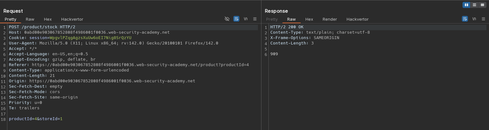
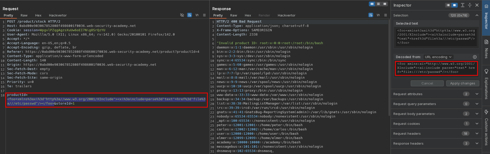

# Exploiting XInclude to retrieve files
# Objective
This lab has a "Check stock" feature that embeds the user input inside a server-side XML document that is subsequently parsed.\
Because you don't control the entire XML document you can't define a DTD to launch a classic XXE attack.\
To solve the lab, inject an `XInclude` statement to retrieve the contents of the `/etc/passwd` file. 

# Solution
## Analysis
Application has a `Check stock` feature. Data from client to server is sent in `x-www-form-urlencoded` format.

||
|:--:| 
| *Check stock request* |

## Exploitation
Request data from client is sent in `x-www-form-urlencoded` format, therefore attacker can not define internal or external DTD. Server uses user input to create XML document which is later parsed. Use of `XInclude` may allow attacker to retrieve contents of server files.

```xml
<foo xmlns:xi="http://www.w3.org/2001/XInclude"><xi:include parse="text" href="file:///etc/passwd"/></foo>
```

||
|:--:| 
| *XInlcude injection* |