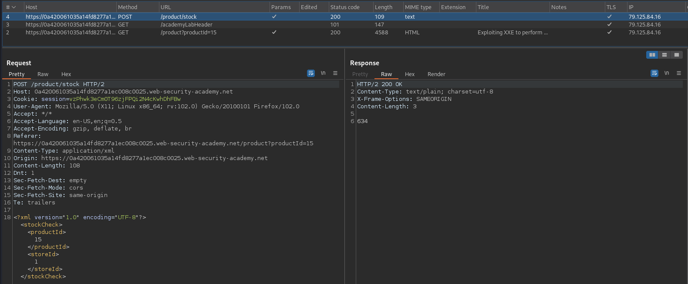
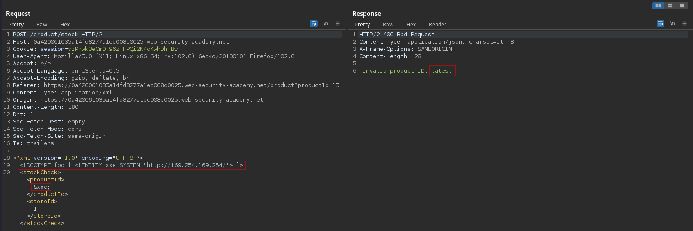
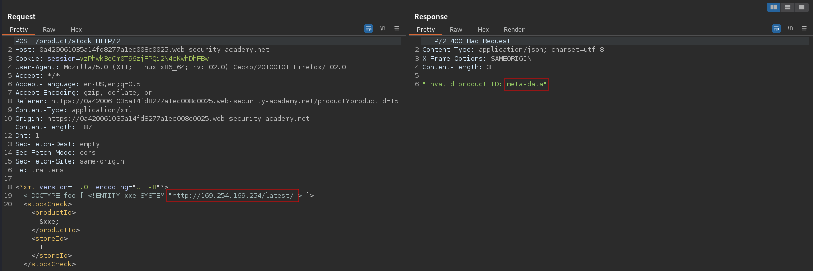
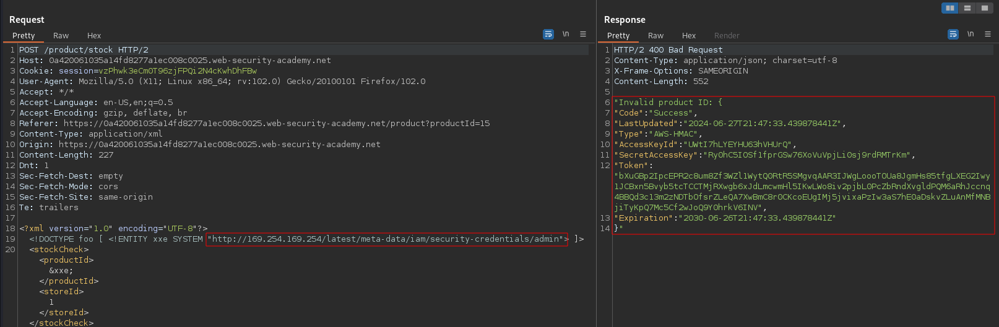

# Exploiting XXE to perform SSRF attacks
# Objective
This lab has a "Check stock" feature that parses XML input and returns any unexpected values in the response.
The lab server is running a (simulated) EC2 metadata endpoint at the default URL, which is `http://169.254.169.254/`. This endpoint can be used to retrieve data about the instance, some of which might be sensitive.
To solve the lab, exploit the XXE vulnerability to perform an SSRF attack that obtains the server's IAM secret access key from the EC2 metadata endpoint.

# Solution
## Analysis
Application has a "Check stock" feature. Data from client to server is sent in XML format.

||
|:--:| 
| *"Check stock" request* |

## Exploitation
Full pass to secret key:
```
http://169.254.169.254/latest/meta-data/iam/security-credentials/admin
```

||
|:--:| 
| *XML injection - SSRF - Next directory "latest"* |
||
| *XML injection - SSRF - Next directory "meta-data" and so on...* |
||
| *XML injection - SSRF - Server's IAM secret access key |