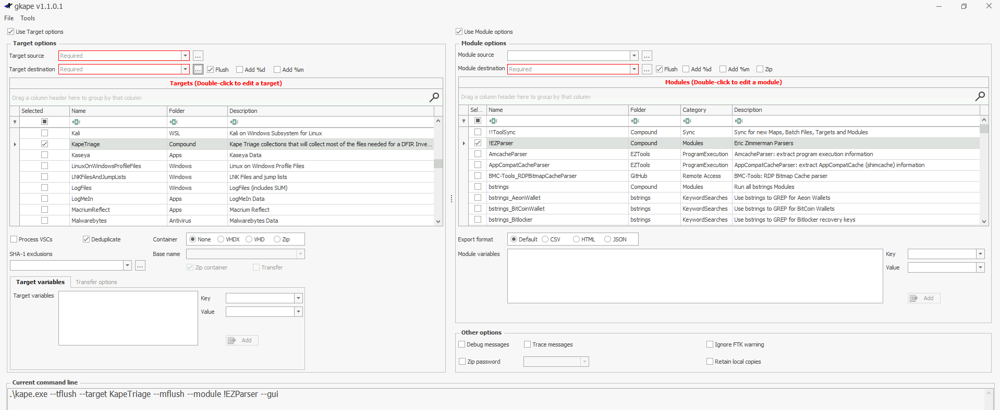
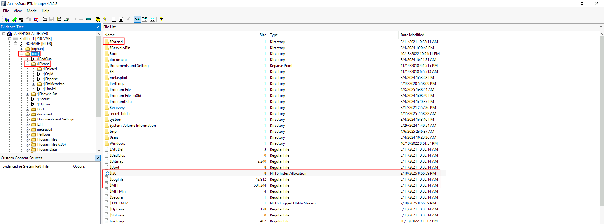

# Forensics
[Windows Registry Information](Registry.md)
## Registry map
```mermaid
mindmap
    root((Windows Registry Hive))
        SAM
            SAM\Domains\Account\Users
        SOFTWARE
            SOFTWARE\Microsoft\Windows NT\CurrentVersion
            SOFTWARE\Microsoft\Windows NT\CurrentVersion\NetworkList\Signatures\Unmanaged
            SOFTWARE\Microsoft\Windows NT\CurrentVersion\NetworkList\Signatures\Managed
            SOFTWARE\Microsoft\Windows\CurrentVersion\RunOnce
            SOFTWARE\Microsoft\Windows\CurrentVersion\policies\Explorer\Run
            SOFTWARE\Microsoft\Windows\CurrentVersion\Run
            SOFTWARE\Microsoft\Windows Portable Devices\Devices
        SYSTEM
            SYSTEM\ControlSet001
            SYSTEM\ControlSet002
            SYSTEM\CurrentControlSet
            SYSTEM\Select\LastKnownGood
            SYSTEM\CurrentControlSet\Control\ComputerName\ComputerName
            SYSTEM\CurrentControlSet\Control\TimeZoneInformation
            SYSTEM\CurrentControlSet\Services\Tcpip\Parameters\Interfaces
            SYSTEM\CurrentControlSet\Service
            SYSTEM\CurrentControlSet\Control\Session Manager\AppCompatCache
            SYSTEM\CurrentControlSet\Services\bam\UserSettings\SID
            SYSTEM\CurrentControlSet\Services\dam\UserSettings\SID
            SYSTEM\CurrentControlSet\Enum\USBSTOR
            SYSTEM\CurrentControlSet\Enum\USB
            SYSTEM\CurrentControlSet\Enum\USBSTOR\Ven_Prod_Version\USBSerial#\Properties\DISK_ID\####
        NTUSER.DAT
            NTUSER.DAT\Software\Microsoft\Windows\CurrentVersion\Run
            NTUSER.DAT\Software\Microsoft\Windows\CurrentVersion\RunOnce
            NTUSER.DAT\Software\Microsoft\Windows\CurrentVersion\Explorer\RecentDocs
            NTUSER.DAT\Software\Microsoft\Windows\CurrentVersion\Explorer\RecentDocs\\.pdf
            NTUSER.DAT\Software\Microsoft\Windows\CurrentVersion\Explorer\RecentDocs\\.jpg
            NTUSER.DAT\Software\Microsoft\Windows\CurrentVersion\Explorer\RecentDocs\\.docx
            NTUSER.DAT\Software\Microsoft\Windows\CurrentVersion\Explorer\RecentDocs\\.ps1
            NTUSER.DAT\Software\Microsoft\Office\VERSION\UserMRU\LiveID_####\FileMRU
            NTUSER.DAT\Software\Microsoft\Windows\Shell\BagMRU
            NTUSER.DAT\Software\Microsoft\Windows\Shell\Bags
            NTUSER.DAT\Software\Microsoft\Windows\CurrentVersion\Explorer\ComDlg32\OpenSavePIDlMRU
            NTUSER.DAT\Software\Microsoft\Windows\CurrentVersion\Explorer\ComDlg32\LastVisitedPidlMRU
            NTUSER.DAT\Software\Microsoft\Windows\CurrentVersion\Explorer\TypedPaths
            NTUSER.DAT\Software\Microsoft\Windows\CurrentVersion\Explorer\WordWheelQuery
            NTUSER.DAT\Software\Microsoft\Windows\Currentversion\Explorer\UserAssist\GUID\Count
        USRCLASS.DAT
            USRCLASS.DAT\Local Settings\Software\Microsoft\Windows\Shell\Bags
            USRCLASS.DAT\Local Settings\Software\Microsoft\Windows\Shell\BagMRU
```

## Tools summary
Data acquisition: FTK Imager, Autopsy, KAPE\
Data analysis: FTK Imager, Autopsy,
Registry hives analysis:  Registry Explorer, RegRipper, ShellBag Explorer, AppCompatCacheParser\
Registry hives analysis: RECmd, PECmd, WxTCmd, JLECmd\
NTFS analysis: MFTECmd\
Data viewer: EZ Viewer, TimeLine Explorer

Eric Zimmerman - [Tools](https://ericzimmerman.github.io/#!index.md)

## Forensic analysis of registry hives
### System information and system accounts

| Information | Location                                        |
| :---------- | :---------------------------------------------- |
| OS Version | SOFTWARE\Microsoft\Windows NT\CurrentVersion  |
| Control set | SYSTEM\ControlSet001 |
| Control set | SYSTEM\ControlSet002 |
| Current Control Set | SYSTEM\CurrentControlSet |
| Last Lnown Good | SYSTEM\Select\LastKnownGood |
| Computer Name | SYSTEM\CurrentControlSet\Control\ComputerName\ComputerName |
| Time Zone Information | SYSTEM\CurrentControlSet\Control\TimeZoneInformation |
| Network Interfaces | SYSTEM\CurrentControlSet\Services\Tcpip\Parameters\Interfaces |
| Past Networks | SOFTWARE\Microsoft\Windows NT\CurrentVersion\NetworkList\Signatures\Unmanaged |
| Past Networks | SOFTWARE\Microsoft\Windows NT\CurrentVersion\NetworkList\Signatures\Managed |
| Autostart Programs | NTUSER.DAT\Software\Microsoft\Windows\CurrentVersion\Run |
| Autostart Programs | NTUSER.DAT\Software\Microsoft\Windows\CurrentVersion\RunOnce |
| Autostart Programs | SOFTWARE\Microsoft\Windows\CurrentVersion\RunOnce |
| Autostart Programs | SOFTWARE\Microsoft\Windows\CurrentVersion\policies\Explorer\Run |
| Autostart Programs | SOFTWARE\Microsoft\Windows\CurrentVersion\Run |
| Services | SYSTEM\CurrentControlSet\Services |
| User Account Information | SAM\Domains\Account\Users |

### Usage of files/folders
ShellBags are a feature in Microsoft Windows used to store user-specific folder view preferences in Windows Explorer. These include details such as:
- Folder window size and position
- View mode (e.g., list, details, thumbnails)
- Sort order
- Icon size
- Screen location of the window

Slack -  refers to unused space within a file cluster on disk - leftover data from previously deleted or overwritten files.

| Information | Location                                        |
| :---------- | :---------------------------------------------- |
| Recent Files | NTUSER.DAT\Software\Microsoft\Windows\CurrentVersion\Explorer\RecentDocs |
| Last Used .pdf File | NTUSER.DAT\Software\Microsoft\Windows\CurrentVersion\Explorer\RecentDocs\\.pdf |
| Last Used .jpg File | NTUSER.DAT\Software\Microsoft\Windows\CurrentVersion\Explorer\RecentDocs\\.jpg |
| Last Used .docx File | NTUSER.DAT\Software\Microsoft\Windows\CurrentVersion\Explorer\RecentDocs\\.docx |
| Last Used .ps1 File | NTUSER.DAT\Software\Microsoft\Windows\CurrentVersion\Explorer\RecentDocs\\.ps1 |
| Office Recent Files | NTUSER.DAT\Software\Microsoft\Office\VERSION\UserMRU\LiveID_####\FileMRU |
| Shell Bags | USRCLASS.DAT\Local Settings\Software\Microsoft\Windows\Shell\Bags |
| Shell Bags | USRCLASS.DAT\Local Settings\Software\Microsoft\Windows\Shell\BagMRU |
| Shell Bags | NTUSER.DAT\Software\Microsoft\Windows\Shell\BagMRU |
| Shell Bags | NTUSER.DAT\Software\Microsoft\Windows\Shell\Bags |
| Open/Save File Dialog | NTUSER.DAT\Software\Microsoft\Windows\CurrentVersion\Explorer\ComDlg32\OpenSavePIDlMRU |
| LastVisited MRU | NTUSER.DAT\Software\Microsoft\Windows\CurrentVersion\Explorer\ComDlg32\LastVisitedPidlMRU |
| Windows Explorer Address/Search Bars | NTUSER.DAT\Software\Microsoft\Windows\CurrentVersion\Explorer\TypedPaths |
| Windows Explorer Address/Search Bars | NTUSER.DAT\Software\Microsoft\Windows\CurrentVersion\Explorer\WordWheelQuery |

### Evidence of execution
UserAssist - contains data about applications launched by the user using Windows Explorer for statistical purposes.\
Shimcache - tracks all applications launched on the machine.\
Amcache - contains data related to program executions.\
BAM/DAM - contains information about last run programs, their full paths, and last execution time.\

| Information | Location                                        |
| :---------- | :---------------------------------------------- |
| User Assist | NTUSER.DAT\Software\Microsoft\Windows\Currentversion\Explorer\UserAssist\\{GUID}\Count |
| ShimCache | SYSTEM\CurrentControlSet\Control\Session Manager\AppCompatCache |
| AmCache | Amcache.hve\Root\File\{Volume GUID}\ |
| Background Activity Monitor (BAM) | SYSTEM\CurrentControlSet\Services\bam\UserSettings\\{SID} |
| Desktop Activity Moderator (DAM) | SYSTEM\CurrentControlSet\Services\dam\UserSettings\\{SID} |


### External devices/USB device forensics

First/Last conncetion times:
- SYSTEM\CurrentControlSet\Enum\USBSTOR\Ven_Prod_Version\USBSerial#\Properties\\{DISK_ID}\\####
    - `0064` - First Connection time
    - `0066` - Last Connection time
    - `0067` - Last removal time

| Information | Location                                        |
| :---------- | :---------------------------------------------- |
| Device identification | SYSTEM\CurrentControlSet\Enum\USBSTOR |
| Device identification | SYSTEM\CurrentControlSet\Enum\USB |
| First/Last Times | SYSTEM\CurrentControlSet\Enum\USBSTOR\Ven_Prod_Version\USBSerial#\Properties\\{DISK_ID}\\#### |
| USB device Volume Name | SOFTWARE\Microsoft\Windows Portable Devices\Devices |


## Forensic tools for registry hives analysis

### KAPE
`KAPE` (Kroll Artifact Parser and Extractor) is a powerful and flexible forensic triage tool. It is divided in 2 components:
- Targets - Define what to collect (e.g., browser history, registry hives, event logs)
- Modules - Define how to process it (e.g., run RECmd on NTUSER.DAT)

||
|:--:| 
| *KAPE GUI (gkape.exe)* |

Command to perform `Triage` target and process data from it using `EZParser` module
```
kape.exe --tsource C: --target KapeTriage --tdest C:\Users\thm-4n6\Desktop\Target --mdest C:\Users\thm-4n6\Desktop\module --module !EZParser
```

### RegRipper
`RegRipper` (rr.exe) is used to extract, parse, and analyze registry data from offline Windows registry hive files like NTUSER.DAT, SYSTEM, SOFTWARE, SAM. It outputs data in .csv format. It does not automatically process hive transaction logs. 

### RECmd
`RECmd` (Registry) - tool for querying, parsing, and analyzing registry hives.

Command:
```
RECmd.exe -f <path-to-Hive-file> --csv <directory-to-save-csv> --csvf <file-to-save-csv>
Options:
    kn              Display details for key name. Includes subkeys and values
    vn              Value name. Only this value will be dumped
    sa              Search for <string> in keys, values, data, and slack.
    sk              Search for <string> in key names.
    sv              Search for <string> in value names
    sd              Search for <string> in value record's value data
    ss              Search for <string> in value record's value slack
    regex           If present, treat <string> in --sk, --sv, --sd, and --ss as a regular expression. Default is FALSE
```

### PECmd
`PECmd`(Prefetch Parser) - tool for parsing Prefetch files and extracting data from them.

Location of prefetch files:
```
C:\Windows\Prefetch\*.pf
```
Command:
```
PECmd.exe -f <path-to-Prefetch-files> --csv <path-to-save-csv>
PECmd.exe -d <path-to-Prefetch-directory> --csv <path-to-save-csv>
```

### WxTCmd
`WxTCmd` (Windows Timeline) - tool for parsing Windows 10 Timeline feature database. Windows 10 stores recently used applications and files in an SQLite database called the Windows 10 Timeline. This data can be a source of information about the last executed programs. It contains the application that was executed and the focus time of the application.

Location of Windows Timeline files:
```
C:\Users\<username>\AppData\Local\ConnectedDevicesPlatform\{randomfolder}\ActivitiesCache.db
```
Command:
```
WxTCmd.exe -f <path-to-Timeline-file> --csv <path-to-save-csv>
```

### JLECmd
`JLECmd` (Windows Jump Lists) - tool for parsing Windows Jump List. Windows introduced jump lists to help users go directly to their recently used files from the taskbar.Jumplists can be viewed by right-clicking an application's icon in the taskbar, and it will show the recently opened files in that application.

Location of Windows Jump Lists:
```
C:\Users\<username>\AppData\Roaming\Microsoft\Windows\Recent\AutomaticDestinations
```
Command:
```
JLECmd.exe -f <path-to-Jumplist-file> --csv <path-to-save-csv>
```

### AmCache parser
`AmcacheParser` gathers information about all the Program entries, then looks at all the File entries. In each file entry is a pointer to a Program ID (value 100). If this Program ID exists in Program entries, the File entry is associated with the Program entry.

Location of Amcache.hve:
```
C:\Windows\AppCompat\Programs\Amcache.hve
```
Command:
```
AppCompatCacheParser.exe -f <path-to-Amcache-hive> --csv <path-to-save-csv>

Outputs:
AmCache_DeviceContainers - KeyName,KeyLastWriteTimestamp,Categories,DiscoveryMethod,FriendlyName,Icon,IsActive,IsConnected,IsMachineContainer,IsNetworked,IsPaired,Manufacturer,ModelId,ModelName,ModelNumber,PrimaryCategory,State
AmCache_DevicePnps       - KeyName,KeyLastWriteTimestamp,BusReportedDescription,Class,ClassGuid,Compid,ContainerId,Description,DriverId,DriverPackageStrongName,DriverName,DriverVerDate,DriverVerVersion,Enumerator,HWID,Inf,InstallState,Manufacturer,MatchingId,Model,ParentId,ProblemCode,Provider,Service,Stackid
AmCache_DriveBinaries    - KeyName,KeyLastWriteTimestamp,DriverTimeStamp,DriverLastWriteTime,DriverName,DriverInBox,DriverIsKernelMode,DriverSigned,DriverCheckSum,DriverCompany,DriverId,DriverPackageStrongName,DriverType,DriverVersion,ImageSize,Inf,Product,ProductVersion,Service,WdfVersion
AmCache_DriverPackages   - KeyName,KeyLastWriteTimestamp,Date,Class,Directory,DriverInBox,Hwids,Inf,Provider,SubmissionId,SYSFILE,Version
AmCache_ShortCuts        - KeyName,LnkName,KeyLastWriteTimestamp
AmCache_UnassociatedFileEntries - ApplicationName,ProgramId,FileKeyLastWriteTimestamp,SHA1,IsOsComponent,FullPath,Name,FileExtension,LinkDate,ProductName,Size,Version,ProductVersion,LongPathHash,BinaryType,IsPeFile,BinFileVersion,BinProductVersion,Usn,Language,Description
```

## Forensic analysis of NTFS
NTFS (New Technology File System) features:
- Journaling
- Access Controls
- Volume Shadow Copy
- Alternate Data Streams

Most important components in NTFS foresic are:
- `$MFT` - Master File Table
- `$LogFile` - Transactions logs
- `$I30` - NTFS Index Attribute
- `$Extend`
    - `$UsnJrnl` - Update Sequence Number Journal
        - `$J` - Stores the actual change records. 

||
|:--:| 
||
||
| *Location of NTFS components* |
| `$I30` *can be found in different directories* |

### $MFT
The `$MFT` (Master File Table) is the core database of the NTFS file system. It contains a detailed record of every file and directory on an NTFS volume, including metadata and sometimes even the file content itself.

Useful attributes:
- Entry Number
    - A unique identifier for the MFT record.
- Parent Entry Number
    - The entry number of the parent directory.
- File Name
    - The name of the file or directory.
- Timestamps
    - MACB (Modified/Accessed/Changed/Birth) Time
- Flags
    - Indicates whether the record represents a file, directory, or unused record (deleted file).
- Entry Flags
    - Indicates if file is Read-only,  Hidden,  System, etc.

### $I30
The `$I30` file is a special NTFS metadata structure used to store directory index information, particularly filenames and metadata for files within directories. It’s not a standalone file but rather a resident NTFS attribute embedded inside directory entries on disk.

Useful attributes:
- Filename
- From Slack
- File Size
- Parent Directory Information
- Timestamps (MACB)
- File Attributes
    - Read Only
    - Hidden
    - Directory / File
    - Archive / Compressed / Encrypted
    - System

### $UsnJrnl and $LogFile
The `$LogFile` is a special NTFS metadata file that records a transactional log of changes made to the NTFS volume. It is part of NTFS’s journaling system used to ensure file system consistency in the event of power loss, crashes, or improper shutdowns.

The `$UsnJrnl` (Update Sequence Number Journal) is an NTFS system file that logs changes to files and directories on a volume. The components of `$UsnJrnl` are:
- $Max: Defines the maximum size of the journal and its allocation policy.
- $J: Stores the actual change records.

Useful attributes (Update Reasons in `$J`):
- FileCreate
- DataExtend
- DataTruncation
- DataOverwrite
- RenameOldName
- FileDelete
- Close

## Forensic tools for NTFS analysis
### MFTECmd

```
MFTECmd.exe -f <path-to-$MFT> --csv ..\Output\ --csvf MFT.csv
EntryNumber, SequenceNumber, InUse, ParentEntryNumber, ParentSequenceNumber, ParentPath, FileName, Extension, FileSize, ReferenceCount, ReparseTarget, IsDirectory, HasAds, IsAds, SI<FN, uSecZeros, Copied, SiFlags, NameType, Created0x10, Created0x30, LastModified0x10, LastModified0x30, LastRecordChange0x10, LastRecordChange0x30, LastAccess0x10, LastAccess0x30, UpdateSequenceNumber, LogfileSequenceNumber, SecurityId, ObjectIdFileDroid, LoggedUtilStream, ZoneIdContents

MFTECmd.exe -f <path-to-$I30> --csv ..\Output\ --csvf I30.csv
Offset, FromSlack, SelfMftEntry, SelfMftSequence, FileName, Flags, NameType, ParentMftEntry, ParentMftSequence, CreatedOn, ContentModifiedOn, RecordModifiedOn, LastAccessedOn, PhysicalSize, LogicalSize, SourceFile

MFTECmd.exe -f <path-to-$J> --csv ..\Output\ --csvf USNJrnl.csv
Name, Extension, EntryNumber, SequenceNumber, ParentEntryNumber, ParentSequenceNumber, ParentPath, UpdateSequenceNumber, UpdateTimestamp, UpdateReasons, FileAttributes, OffsetToData, SourceFile
```

## Forensic analysis of powershell history

Location of powershell hisotry commands:
```
C:\Users\<username>\AppData\Roaming\Microsoft\Windows\PowerShell\PSReadLine\ConsoleHost_history.txt
```