# Registry Forensics

[Windows Registry Information](Registry.md)

## Registry map

```mermaid
stateDiagram
    direction LR
    state Windows_Registry_Diagram {
        direction LR
        [*] --> SAM
        [*] --> SOFTWARE
        [*] --> SYSTEM
        [*] --> NTUSER.DAT
        [*] --> USRCLASS.DAT


    state SAM {
        direction LR
        [*] --> SAM\Domains\Account\Users
    }

    state SOFTWARE {
        direction LR
        [*] --> SOFTWARE\Microsoft\Windows_NT\CurrentVersion
        [*] --> SOFTWARE\Microsoft\Windows_NT\CurrentVersion\NetworkList\Signatures\Unmanaged
        [*] --> SOFTWARE\Microsoft\Windows_NT\CurrentVersion\NetworkList\Signatures\Managed
        [*] --> SOFTWARE\Microsoft\Windows\CurrentVersion\RunOnce
        [*] --> SOFTWARE\Microsoft\Windows\CurrentVersion\policies\Explorer\Run
        [*] --> SOFTWARE\Microsoft\Windows\CurrentVersion\Run
        [*] --> SOFTWARE\Microsoft\Windows_Portable_Devices\Devices
    }

    state SYSTEM {
        direction LR
        [*] --> SYSTEM\ControlSet001
        [*] --> SYSTEM\ControlSet002
        [*] --> SYSTEM\CurrentControlSet
        [*] --> SYSTEM\Select\LastKnownGood
        [*] --> SYSTEM\CurrentControlSet\Control\ComputerName\ComputerName
        [*] --> SYSTEM\CurrentControlSet\Control\TimeZoneInformation
        [*] --> SYSTEM\CurrentControlSet\Services\Tcpip\Parameters\Interfaces
        [*] --> SYSTEM\CurrentControlSet\Service
        [*] --> SYSTEM\CurrentControlSet\Control\Session_Manager\AppCompatCache
        [*] --> SYSTEM\CurrentControlSet\Services\bam\UserSettings\SID
        [*] --> SYSTEM\CurrentControlSet\Services\dam\UserSettings\SID
        [*] --> SYSTEM\CurrentControlSet\Enum\USBSTOR
        [*] --> SYSTEM\CurrentControlSet\Enum\USB
        [*] --> SYSTEM\CurrentControlSet\Enum\USBSTOR\Ven_Prod_Version\USBSerial#\Properties\DISK_ID\####
    }

    state NTUSER.DAT {
        direction LR
        [*] --> NTUSER.DAT\Software\Microsoft\Windows\CurrentVersion\Run
        [*] --> NTUSER.DAT\Software\Microsoft\Windows\CurrentVersion\RunOnce
        [*] --> NTUSER.DAT\Software\Microsoft\Windows\CurrentVersion\Explorer\RecentDocs
        [*] --> NTUSER.DAT\Software\Microsoft\Windows\CurrentVersion\Explorer\RecentDocs\\.pdf
        [*] --> NTUSER.DAT\Software\Microsoft\Windows\CurrentVersion\Explorer\RecentDocs\\.jpg
        [*] --> NTUSER.DAT\Software\Microsoft\Windows\CurrentVersion\Explorer\RecentDocs\\.docx
        [*] --> NTUSER.DAT\Software\Microsoft\Windows\CurrentVersion\Explorer\RecentDocs\\.ps1
        [*] --> NTUSER.DAT\Software\Microsoft\Office\VERSION\UserMRU\LiveID_####\FileMRU
        [*] --> NTUSER.DAT\Software\Microsoft\Windows\Shell\BagMRU
        [*] --> NTUSER.DAT\Software\Microsoft\Windows\Shell\Bags
        [*] --> NTUSER.DAT\Software\Microsoft\Windows\CurrentVersion\Explorer\ComDlg32\OpenSavePIDlMRU
        [*] --> NTUSER.DAT\Software\Microsoft\Windows\CurrentVersion\Explorer\ComDlg32\LastVisitedPidlMRU
        [*] --> NTUSER.DAT\Software\Microsoft\Windows\CurrentVersion\Explorer\TypedPaths
        [*] --> NTUSER.DAT\Software\Microsoft\Windows\CurrentVersion\Explorer\WordWheelQuery
        [*] --> NTUSER.DAT\Software\Microsoft\Windows\Currentversion\Explorer\UserAssist\GUID\Count
    }

    state USRCLASS.DAT {
        direction LR
        [*] --> USRCLASS.DAT\Local_Settings\Software\Microsoft\Windows\Shell\Bags
        [*] --> USRCLASS.DAT\Local_Settings\Software\Microsoft\Windows\Shell\BagMRU
    }
}
```

## Forensic tools for registry hives analysis
### Tools summary
Data acquisition: FTK Imager, Autopsy, KAPE\
Data analysis: FTK Imager, Autopsy,
Registry hives analysis:  Registry Explorer, RegRipper, ShellBag Explorer, JumpList Explorer, SDB Explorer (Shim), AppCompatCacheParser\
Registry hives analysis: RECmd, PECmd, WxTCmd, JLECmd, LECmd\
NTFS analysis: MFTECmd\
Data viewer: EZ Viewer, TimeLine Explorer

Eric Zimmerman - [Tools](https://ericzimmerman.github.io/#!index.md)


### KAPE
`KAPE` (Kroll Artifact Parser and Extractor) is a powerful and flexible forensic triage tool. It is divided in 2 components:
- Targets - Define what to collect (e.g., browser history, registry hives, event logs)
- Modules - Define how to process it (e.g., run RECmd on NTUSER.DAT)

||
|:--:| 
| *KAPE GUI (gkape.exe)* |

Command to perform `Triage` target and process data from it using `EZParser` module
```
kape.exe --tsource C: --target KapeTriage --tdest C:\Users\thm-4n6\Desktop\Target --mdest C:\Users\thm-4n6\Desktop\module --module !EZParser
```

### RegRipper
`RegRipper` (rr.exe) is used to extract, parse, and analyze registry data from offline Windows registry hive files like NTUSER.DAT, SYSTEM, SOFTWARE, SAM. It outputs data in .csv format. It does not automatically process hive transaction logs. 

### RECmd
`RECmd` (Registry Explorer Command Line) - tool for querying, parsing, and analyzing registry hives.

Command:
```
RECmd.exe -f <path-to-Hive-file> --csv <directory-to-save-csv> --csvf <file-to-save-csv>
Options:
    kn              Display details for key name. Includes subkeys and values
    vn              Value name. Only this value will be dumped
    sa              Search for <string> in keys, values, data, and slack.
    sk              Search for <string> in key names.
    sv              Search for <string> in value names
    sd              Search for <string> in value record's value data
    ss              Search for <string> in value record's value slack
    regex           If present, treat <string> in --sk, --sv, --sd, and --ss as a regular expression. Default is FALSE
```

### PECmd
`PECmd` (Prefetch Explorer Command Line) - tool for parsing Prefetch files and extracting data from them.

Location of prefetch files:
```
C:\Windows\Prefetch\*.pf
```

Command:
```
PECmd.exe -f <path-to-Prefetch-files> --csv <directory-to-save-csv> --csvf <file-to-save-csv>
PECmd.exe -d <path-to-Prefetch-directory> --csv <directory-to-save-csv> --csvf <file-to-save-csv>

Output columns:
Note, SourceFilename, SourceCreated, SourceModified, SourceAccessed, ExecutableName, Hash, Size, Version, RunCount, LastRun, PreviousRun0, PreviousRun1, PreviousRun2, PreviousRun3, PreviousRun4, PreviousRun5, PreviousRun6, Volume0Name, Volume0Serial, Volume0Created, Volume1Name, Volume1Serial, Volume1Created, Directories, FilesLoaded, ParsingError
```

### WxTCmd
`WxTCmd` (Windows Timeline Explorer Command Line) - tool for parsing Windows 10 Timeline feature database. Windows 10 stores recently used applications and files in an SQLite database called the Windows 10 Timeline. This data can be a source of information about the last executed programs. It contains the application that was executed and the focus time of the application.

Location of Windows Timeline files:
```
C:\Users\<username>\AppData\Local\ConnectedDevicesPlatform\{randomfolder}\ActivitiesCache.db
```
Command:
```
WxTCmd.exe -f <path-to-Timeline-file> --csv <directory-to-save-csv> 

Output columsn:
Activity: Id, ActivityTypeOrg, ActivityType, Executable, DisplayText, ContentInfo, Payload, ClipboardPayload, StartTime, EndTime, Duration, LastModifiedTime, LastModifiedOnClient, OriginalLastModifiedOnClient, ExpirationTime, CreatedInCloud, IsLocalOnly, ETag, PackageIdHash, PlatformDeviceId, DevicePlatform, TimeZone
Activity Package: Id, Platform, Name, AdditionalInformation, Expires
```

### JLECmd
`JLECmd` (Windows Jump Lists Explorer Command Line) - tool for parsing Windows Jump List. Windows introduced jump lists to help users go directly to their recently used files from the taskbar. Jumplists can be viewed by right-clicking an application's icon in the taskbar, and it will show the recently opened files in that application.

Location of Windows Jump Lists:
```
C:\Users\<username>\AppData\Roaming\Microsoft\Windows\Recent\AutomaticDestinations
C:\Users\<username>\AppData\Roaming\Microsoft\Windows\Recent\CustomDestinations
```

Command:
```
JLECmd.exe -f <path-to-Jumplist-file> --csv <directory-to-save-csv> --csvf <file-to-save-csv>
JLECmd.exe -d <path-to-Jumplist-directory> --csv <directory-to-save-csv> --csvf <file-to-save-csv>

Output columns:
AutomaticDestinations: SourceFile, SourceCreated, SourceModified, SourceAccessed, AppId, AppIdDescription, HasSps, DestListVersion, LastUsedEntryNumber, MRU, EntryNumber, CreationTime, LastModified, Hostname, MacAddress, Path, InteractionCount, PinStatus, FileBirthDroid, FileDroid, VolumeBirthDroid, VolumeDroid, TargetCreated, TargetModified, TargetAccessed, FileSize, RelativePath, WorkingDirectory, FileAttributes, HeaderFlags, DriveType, VolumeSerialNumber, VolumeLabel, LocalPath, CommonPath, TargetIDAbsolutePath, TargetMFTEntryNumber, TargetMFTSequenceNumber, MachineID, MachineMACAddress, TrackerCreatedOn, ExtraBlocksPresent, Arguments, Notes
CustomDestinations: SourceFile, SourceCreated, SourceModified, SourceAccessed, AppId, AppIdDescription, EntryName, TargetCreated, TargetModified, TargetAccessed, FileSize, RelativePath, WorkingDirectory, FileAttributes, HeaderFlags, DriveType, VolumeSerialNumber, VolumeLabel, LocalPath, CommonPath, TargetIDAbsolutePath, TargetMFTEntryNumber, TargetMFTSequenceNumber, MachineID, MachineMACAddress, TrackerCreatedOn, ExtraBlocksPresent, Arguments
```

### LECmd
`LECmd` (Link Explorer Command Line) - tool for parsing and analysing Windows .lnk (shortcut) files.

Location of link files:
```
C:\Users\<username>\AppData\Roaming\Microsoft\Windows\Recent\
C:\Users\<username>\AppData\Roaming\Microsoft\Office\Recent\
```

Comand:
```
LECmd.exe -f <path-to-shortcut-files> --csv <directory-to-save-csv> --csvf <file-to-save-csv>
LECmd.exe -d <path-to-shortcut-directory> --csv <directory-to-save-csv> --csvf <file-to-save-csv>

Output columns:
SourceFile, SourceCreated, SourceModified, SourceAccessed, TargetCreated, TargetModified, TargetAccessed, FileSize, RelativePath, WorkingDirectory, FileAttributes, HeaderFlags, DriveType, VolumeSerialNumber, VolumeLabel, LocalPath, NetworkPath, CommonPath, Arguments, TargetIDAbsolutePath, TargetMFTEntryNumber, TargetMFTSequenceNumber, MachineID, MachineMACAddress, MACVendor, TrackerCreatedOn, ExtraBlocksPresent
```

### AmCache parser
`AmcacheParser` - tool that gathers information about all the Program entries, then looks at all the File entries. In each file entry is a pointer to a Program ID (value 100). If this Program ID exists in Program entries, the File entry is associated with the Program entry.

Location of Amcache.hve:
```
C:\Windows\AppCompat\Programs\Amcache.hve
```
Command:
```
AppCompatCacheParser.exe -f <path-to-Amcache-hive> --csv <directory-to-save-csv> --csvf <file-to-save-csv>

Output columns:
AmCache_DeviceContainers - KeyName,KeyLastWriteTimestamp,Categories,DiscoveryMethod,FriendlyName,Icon,IsActive,IsConnected,IsMachineContainer,IsNetworked,IsPaired,Manufacturer,ModelId,ModelName,ModelNumber,PrimaryCategory,State
AmCache_DevicePnps       - KeyName,KeyLastWriteTimestamp,BusReportedDescription,Class,ClassGuid,Compid,ContainerId,Description,DriverId,DriverPackageStrongName,DriverName,DriverVerDate,DriverVerVersion,Enumerator,HWID,Inf,InstallState,Manufacturer,MatchingId,Model,ParentId,ProblemCode,Provider,Service,Stackid
AmCache_DriveBinaries    - KeyName,KeyLastWriteTimestamp,DriverTimeStamp,DriverLastWriteTime,DriverName,DriverInBox,DriverIsKernelMode,DriverSigned,DriverCheckSum,DriverCompany,DriverId,DriverPackageStrongName,DriverType,DriverVersion,ImageSize,Inf,Product,ProductVersion,Service,WdfVersion
AmCache_DriverPackages   - KeyName,KeyLastWriteTimestamp,Date,Class,Directory,DriverInBox,Hwids,Inf,Provider,SubmissionId,SYSFILE,Version
AmCache_ShortCuts        - KeyName,LnkName,KeyLastWriteTimestamp
AmCache_UnassociatedFileEntries - ApplicationName,ProgramId,FileKeyLastWriteTimestamp,SHA1,IsOsComponent,FullPath,Name,FileExtension,LinkDate,ProductName,Size,Version,ProductVersion,LongPathHash,BinaryType,IsPeFile,BinFileVersion,BinProductVersion,Usn,Language,Description
```

## Forensic analysis of registry hives
### System information and system accounts

| Information | Location                                        |
| :---------- | :---------------------------------------------- |
| OS Version | SOFTWARE\Microsoft\Windows NT\CurrentVersion  |
| Control set | SYSTEM\ControlSet001 |
| Control set | SYSTEM\ControlSet002 |
| Current Control Set | SYSTEM\CurrentControlSet |
| Last Lnown Good | SYSTEM\Select\LastKnownGood |
| Computer Name | SYSTEM\CurrentControlSet\Control\ComputerName\ComputerName |
| Time Zone Information | SYSTEM\CurrentControlSet\Control\TimeZoneInformation |
| Network Interfaces | SYSTEM\CurrentControlSet\Services\Tcpip\Parameters\Interfaces |
| Past Networks | SOFTWARE\Microsoft\Windows NT\CurrentVersion\NetworkList\Signatures\Unmanaged |
| Past Networks | SOFTWARE\Microsoft\Windows NT\CurrentVersion\NetworkList\Signatures\Managed |
| Autostart Programs | NTUSER.DAT\Software\Microsoft\Windows\CurrentVersion\Run |
| Autostart Programs | NTUSER.DAT\Software\Microsoft\Windows\CurrentVersion\RunOnce |
| Autostart Programs | SOFTWARE\Microsoft\Windows\CurrentVersion\RunOnce |
| Autostart Programs | SOFTWARE\Microsoft\Windows\CurrentVersion\policies\Explorer\Run |
| Autostart Programs | SOFTWARE\Microsoft\Windows\CurrentVersion\Run |
| Services | SYSTEM\CurrentControlSet\Services |
| User Account Information | SAM\Domains\Account\Users |

### Usage of files/folders
ShellBags are a feature in Microsoft Windows used to store user-specific folder view preferences in Windows Explorer. These include details such as:
- Network and External Drive Access
- Deleted Folders
- Folder window size and position
- View mode (e.g., list, details, thumbnails)
- Sort order
- Icon size
- Screen location of the window

Slack -  refers to unused space within a file cluster on disk - leftover data from previously deleted or overwritten files.

The `ComDlg32` (Common dialogue Box) registry key provides insight into what files and folders a user interacted with via common dialog boxes (like Open/Save As dialogs) in Windows.

| Information | Location                                        |
| :---------- | :---------------------------------------------- |
| Recent Files | NTUSER.DAT\Software\Microsoft\Windows\CurrentVersion\Explorer\RecentDocs |
| Last Used .pdf File | NTUSER.DAT\Software\Microsoft\Windows\CurrentVersion\Explorer\RecentDocs\\.pdf |
| Last Used .jpg File | NTUSER.DAT\Software\Microsoft\Windows\CurrentVersion\Explorer\RecentDocs\\.jpg |
| Last Used .docx File | NTUSER.DAT\Software\Microsoft\Windows\CurrentVersion\Explorer\RecentDocs\\.docx |
| Last Used .ps1 File | NTUSER.DAT\Software\Microsoft\Windows\CurrentVersion\Explorer\RecentDocs\\.ps1 |
| Office Recent Files | NTUSER.DAT\Software\Microsoft\Office\VERSION\UserMRU\LiveID_####\FileMRU |
| Shell Bags | USRCLASS.DAT\Local Settings\Software\Microsoft\Windows\Shell\Bags |
| Shell Bags | USRCLASS.DAT\Local Settings\Software\Microsoft\Windows\Shell\BagMRU |
| Shell Bags | NTUSER.DAT\Software\Microsoft\Windows\Shell\BagMRU |
| Shell Bags | NTUSER.DAT\Software\Microsoft\Windows\Shell\Bags |
| Open/Save File Dialog | NTUSER.DAT\Software\Microsoft\Windows\CurrentVersion\Explorer\ComDlg32\OpenSavePIDlMRU |
| LastVisited MRU | NTUSER.DAT\Software\Microsoft\Windows\CurrentVersion\Explorer\ComDlg32\LastVisitedPidlMRU |
| Windows Explorer Address Bar | NTUSER.DAT\Software\Microsoft\Windows\CurrentVersion\Explorer\TypedPaths |
| Windows Explorer Search Bar | NTUSER.DAT\Software\Microsoft\Windows\CurrentVersion\Explorer\WordWheelQuery |

### Evidence of execution
UserAssist - contains data about applications launched by the user using Windows Explorer for statistical purposes.\
Shimcache - tracks all applications launched on the machine.\
Amcache - contains data related to program executions.\
BAM/DAM - contains information about last run programs, their full paths, and last execution time.\

| Information | Location                                        |
| :---------- | :---------------------------------------------- |
| User Assist | NTUSER.DAT\Software\Microsoft\Windows\Currentversion\Explorer\UserAssist\\{GUID}\Count |
| ShimCache | SYSTEM\CurrentControlSet\Control\Session Manager\AppCompatCache |
| AmCache | Amcache.hve\Root\File\{Volume GUID}\ |
| Background Activity Monitor (BAM) | SYSTEM\CurrentControlSet\Services\bam\UserSettings\\{SID} |
| Desktop Activity Moderator (DAM) | SYSTEM\CurrentControlSet\Services\dam\UserSettings\\{SID} |
| Programs started via `run` dialog | NTUSER.DAT\Software\Microsoft\Windows\CurrentVersion\Explorer\RunMRU |

### External devices/USB device forensics

First/Last conncetion times:
- SYSTEM\CurrentControlSet\Enum\USBSTOR\Ven_Prod_Version\USBSerial#\Properties\\{DISK_ID}\\####
    - `0064` - First Connection time
    - `0066` - Last Connection time
    - `0067` - Last removal time

| Information | Location                                        |
| :---------- | :---------------------------------------------- |
| Device identification | SYSTEM\CurrentControlSet\Enum\USBSTOR |
| Device identification | SYSTEM\CurrentControlSet\Enum\USB |
| First/Last Times | SYSTEM\CurrentControlSet\Enum\USBSTOR\Ven_Prod_Version\USBSerial#\Properties\\{DISK_ID}\\#### |
| USB device Volume Name | SOFTWARE\Microsoft\Windows Portable Devices\Devices |

The file `C:\Windows\inf\setupapi.dev.log` is a Windows setup log file that records detailed information about device driver installations and updates.

Shortcut files can provide information about connected USB devices. It can provide information about the volume name, type, and serial number. 
```
C:\Users\<username>\AppData\Roaming\Microsoft\Windows\Recent\
C:\Users\<username>\AppData\Roaming\Microsoft\Office\Recent\
```

### Shortcut files
Shortcut files contain information about the first and last opened times of the file and the path of the opened file, along with some other data. Windows creates a shortcut file for each file opened either locally or remotely. 
```
C:\Users\<username>\AppData\Roaming\Microsoft\Windows\Recent\
C:\Users\<username>\AppData\Roaming\Microsoft\Office\Recent\
```

