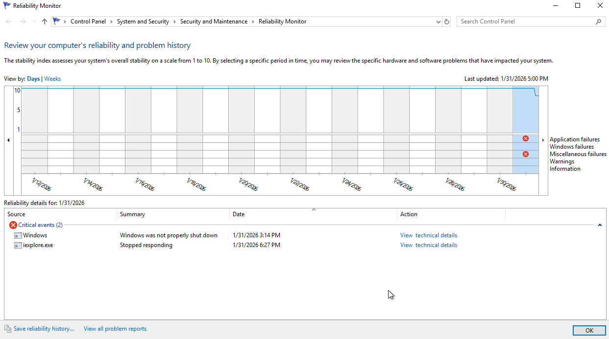
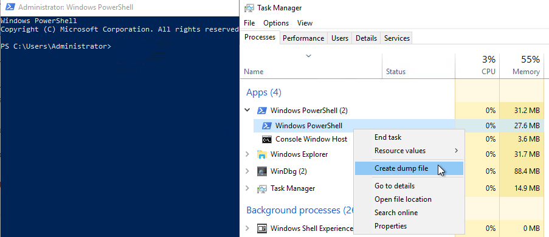
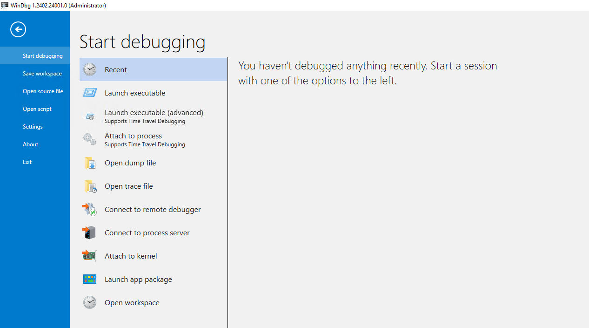

# Volatile Memory Analysys

`pagefile.sys` - extension of RAM
`hiberfil.sys` - hibernation file

## Page file
Location - `C:\pagefile.sys`

### FTK Imager
Page file can be extracted using FTK Imager

### Strings:
```
strings.exe C:\pagefile.sys
```

### Bulk Extractor
```
bulk_extractor.exe -o output C:\pagefile.sys
```


## Hibernation file
Location - `C:\hiberfil.sys`

### FTK Imager
Hibernation file can be extracted using FTK Imager

### Strings
```
strings.exe C:\hiberfil.sys
```

### Hibernation Recon
[Hibernation Recon](https://arsenalrecon.com/products/hibernation-recon) can be used to process `hiberfil.sys`.

### Volatility
[Volatility](../../Tools/volatility.md) can be used to process `hiberfil.sys`.
```
vol.exe -f file.mem windows.info.Info
vol.exe -f file.mem windows.pslist.PsList
vol.exe -f file.mem windows.cmdline.CmdLine
...
```


## Crash dump
### Crash dump configuration


### Reliability Monitor


## Creating process dump file


### WinDbg


Commands
```
!analyze -v           - Analyze dump
!time                 - Get time of the crash
!sysinfo cpuinfo      - Get information about system
!sysinfo machineid    - Get information about system
!vm                   - Get virtual memory usage
.tlist                - Get all the running processes at the time of hibernation
!process 0 0          - Get information about process at the time of the crash
!peb                  - Get windows environment information
```