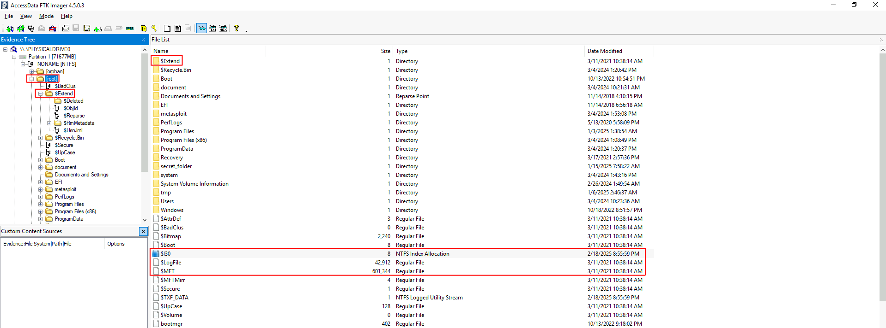
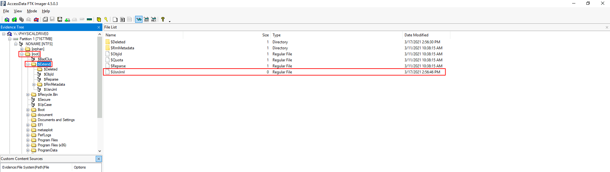
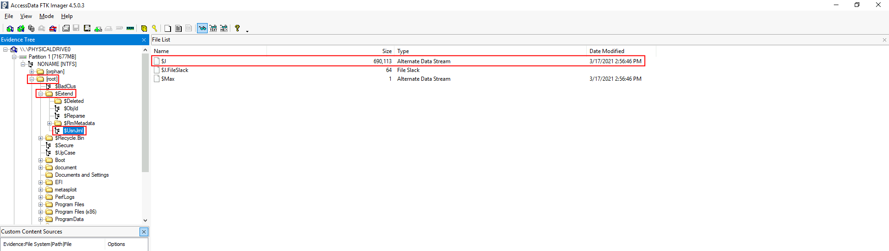

# NTFS Forensics

## Forensic tools for NTFS analysis
### MFTECmd
`MFTECmd` (MFT Explorer Command Line) - tool for parsing NTFS file systems.

```
MFTECmd.exe -f <path-to-$MFT> --csv ..\Output\ --csvf MFT.csv
Output columns:
EntryNumber, SequenceNumber, InUse, ParentEntryNumber, ParentSequenceNumber, ParentPath, FileName, Extension, FileSize, ReferenceCount, ReparseTarget, IsDirectory, HasAds, IsAds, SI<FN, uSecZeros, Copied, SiFlags, NameType, Created0x10, Created0x30, LastModified0x10, LastModified0x30, LastRecordChange0x10, LastRecordChange0x30, LastAccess0x10, LastAccess0x30, UpdateSequenceNumber, LogfileSequenceNumber, SecurityId, ObjectIdFileDroid, LoggedUtilStream, ZoneIdContents

MFTECmd.exe -f <path-to-$I30> --csv ..\Output\ --csvf I30.csv
Output columns:
Offset, FromSlack, SelfMftEntry, SelfMftSequence, FileName, Flags, NameType, ParentMftEntry, ParentMftSequence, CreatedOn, ContentModifiedOn, RecordModifiedOn, LastAccessedOn, PhysicalSize, LogicalSize, SourceFile

MFTECmd.exe -f <path-to-$J> --csv ..\Output\ --csvf USNJrnl.csv
Output columns:
Name, Extension, EntryNumber, SequenceNumber, ParentEntryNumber, ParentSequenceNumber, ParentPath, UpdateSequenceNumber, UpdateTimestamp, UpdateReasons, FileAttributes, OffsetToData, SourceFile
```

## Forensic analysis of NTFS
NTFS (New Technology File System) features:
- Journaling
- Access Controls
- Volume Shadow Copy
- Alternate Data Streams

Most important components in NTFS foresic are:
- `$MFT` - Master File Table
- `$LogFile` - Transactions logs
- `$I30` - NTFS Index Attribute
- `$Extend`
    - `$UsnJrnl` - Update Sequence Number Journal
        - `$J` - Stores the actual change records. 

||
|:--:| 
||
||
| *Location of NTFS components* |
| `$I30` *can be found in different directories* |

### $MFT
The `$MFT` (Master File Table) is the core database of the NTFS file system. It contains a detailed record of every file and directory on an NTFS volume, including metadata and sometimes even the file content itself.

Useful attributes:
- Entry Number
    - A unique identifier for the MFT record.
- Parent Entry Number
    - The entry number of the parent directory.
- File Name
    - The name of the file or directory.
- Timestamps
    - MACB (Modified/Accessed/Changed/Birth) Time
- Flags
    - Indicates whether the record represents a file, directory, or unused record (deleted file).
- Entry Flags
    - Indicates if file is Read-only,  Hidden,  System, etc.

### $I30
The `$I30` file is a special NTFS metadata structure used to store directory index information, particularly filenames and metadata for files within directories. It’s not a standalone file but rather a resident NTFS attribute embedded inside directory entries on disk.

Useful attributes:
- Filename
- From Slack
- File Size
- Parent Directory Information
- Timestamps (MACB)
- File Attributes
    - Read Only
    - Hidden
    - Directory / File
    - Archive / Compressed / Encrypted
    - System

### $UsnJrnl and $LogFile
The `$LogFile` is a special NTFS metadata file that records a transactional log of changes made to the NTFS volume. It is part of NTFS’s journaling system used to ensure file system consistency in the event of power loss, crashes, or improper shutdowns.

The `$UsnJrnl` (Update Sequence Number Journal) is an NTFS system file that logs changes to files and directories on a volume. The components of `$UsnJrnl` are:
- $Max: Defines the maximum size of the journal and its allocation policy.
- $J: Stores the actual change records.

Useful attributes (Update Reasons in `$J`):
- FileCreate
- DataExtend
- DataTruncation
- DataOverwrite
- RenameOldName
- FileDelete
- Close
