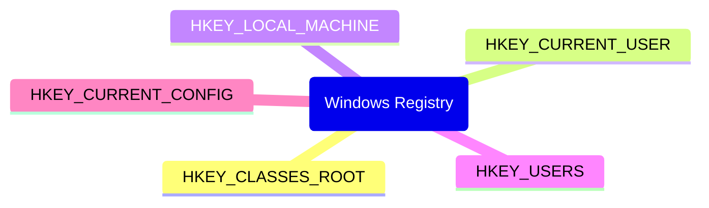
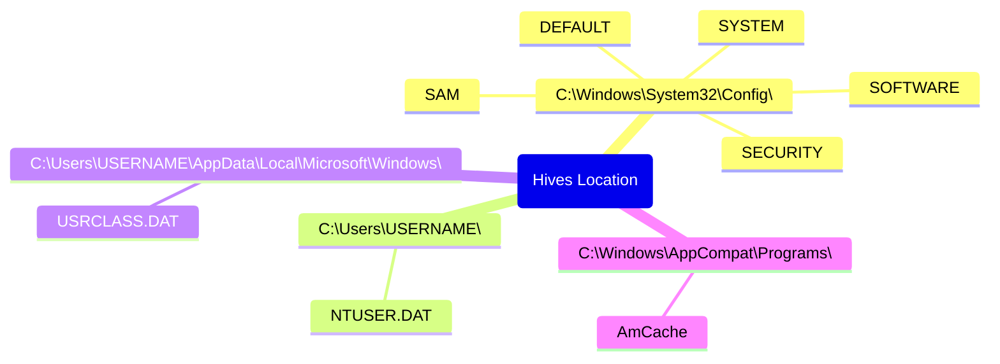
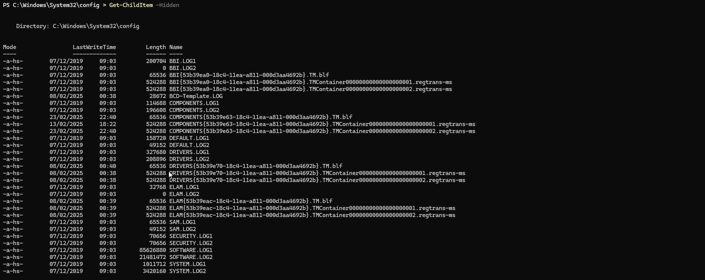
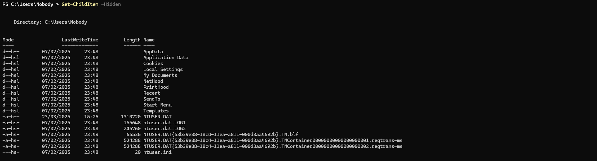
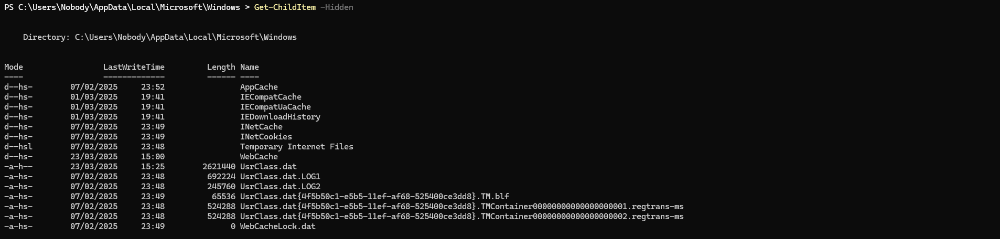
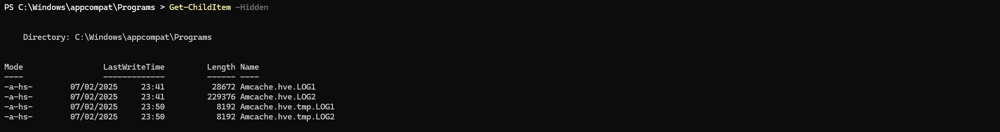

# Registry
[Windows Forensic Information](Forensic.md)

| Registry | Acronym | Short description |
| :--------: | :----: | :------- |
| HKEY_CLASSES_ROOT | HKCR | Contains information that makes sure that the correct program opens when you open a file by using Windows Explorer.|
| HKEY_CURRENT_USER | HKCU | Contains settings and configuration specifically for the currently logged-in user. |
| HKEY_USERS | HKU | Contains all the actively loaded user profiles on the computer. HKCU is subkey of HKU. |
| HKEY_LOCAL_MACHINE | HKLM | Contains configuration information particular to the computer (for any user). |
| HKEY_CURRENT_CONFIG | HKCC | Contains information about the hardware profile that is used by the local computer at system startup. |

# Registry hives location

| Hive | Registry Name | Location | Mount Point |
| :--------: | :----: | :---- | :------- |
| NTUSER.DAT | HKCU |`C:\Users\<username>\` | mounted on `HKEY_CURRENT_USER` when a user logs in|
| USRCLASS.DAT | HKCU |`C:\Users\<username>\AppData\Local\Microsoft\Windows\` | mounted on `HKEY_CURRENT_USER\Software\CLASSES` when a user logs in | 
| SAM | HKLM | `C:\Windows\System32\Config\` | mounted on `HKEY_LOCAL_MACHINE\SAM`| 
| SECURITY | HKLM | `C:\Windows\System32\Config\` | mounted on `HKEY_LOCAL_MACHINE\Security`|
| SOFTWARE | HKLM | `C:\Windows\System32\Config\` | mounted on `HKEY_LOCAL_MACHINE\Software`|
| SYSTEM | HKLM | `C:\Windows\System32\Config\` | mounted on `HKEY_LOCAL_MACHINE\System`|
| DEFAULT | HKU | `C:\Windows\System32\Config\` | mounted on `HKEY_USERS\DEFAULT`| 
| AmCache | HKLM | `C:\Windows\AppCompat\Programs\` | mounted on `HKEY_LOCAL_MACHINE\Software` |

||
|:--:| 
||
||
||
| *Location of registry hives* |

Transaction Logs (`.LOG1`, `.LOG2`, `.LOG3`) are temporary log files that Windows uses to make registry changes safer and more crash-resistant.
Regsitry backup location - `C:\Windows\System32\Config\RegBack`.
